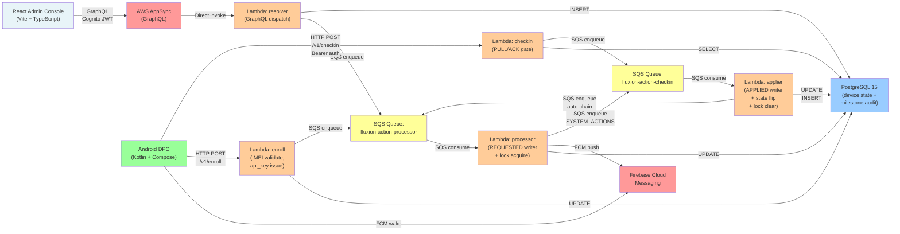
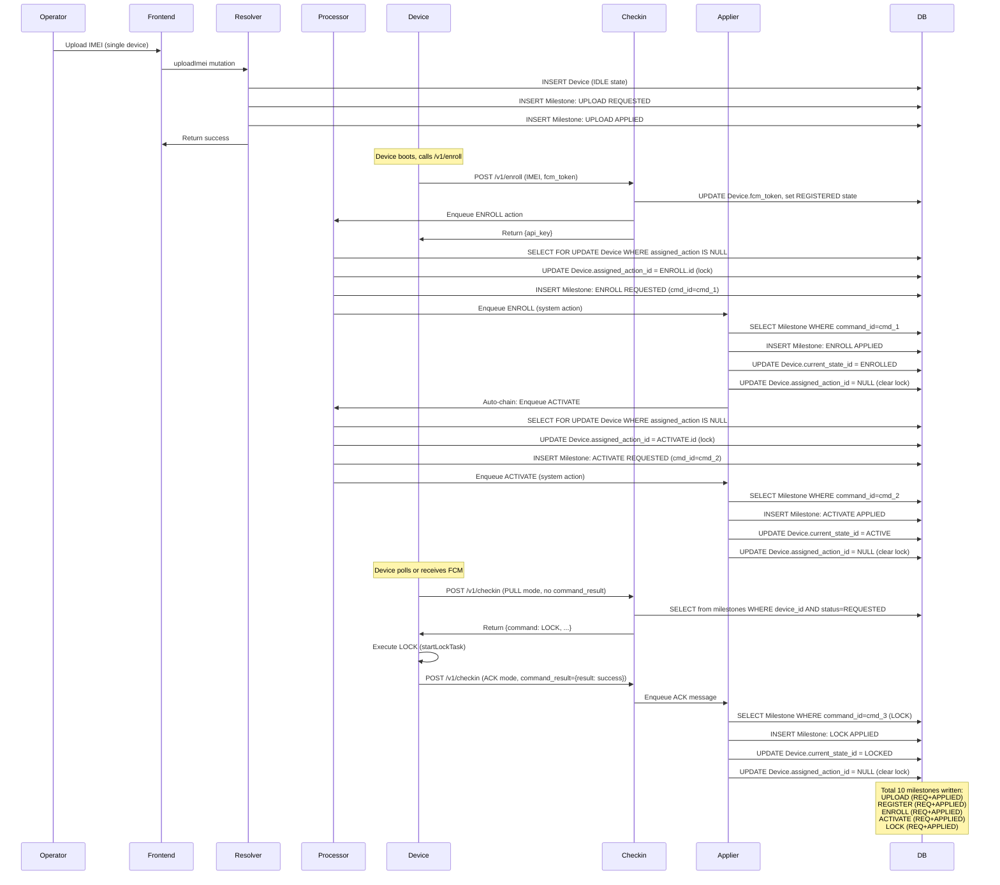

# Fluxion Platform — System Architecture

## End-to-End Architecture



## Device Lifecycle State Machine

```mermaid
stateDiagram-v2
    [*] --> IDLE
    
    IDLE -->|REGISTER<br/>(system)| REGISTERED
    REGISTERED -->|ENROLL<br/>(system)| ENROLLED
    ENROLLED -->|ACTIVATE<br/>(system, auto-chain)| ACTIVE
    
    ACTIVE -->|LOCK<br/>(operator FCM + ack)| LOCKED
    LOCKED -->|UNLOCK<br/>(operator FCM + ack)| ACTIVE
    
    ACTIVE -->|RELEASE_FROM_ACTIVE<br/>(operator)| RELEASED
    LOCKED -->|RELEASE_FROM_LOCKED<br/>(operator)| RELEASED
    
    ACTIVE -->|NOTIFY_FROM_ACTIVE<br/>(in-place, operator)| ACTIVE
    LOCKED -->|NOTIFY_FROM_LOCKED<br/>(in-place, operator)| LOCKED
    
    RELEASED --> [*]
    
    note right of IDLE
        Device not yet enrolled.
        Can be uploaded via /v1/upload.
    end note
    
    note right of REGISTERED
        IMEI validated, awaiting enrollment.
    end note
    
    note right of ENROLLED
        Device enrolled, awaiting activation.
        ACTIVATE auto-chains from ENROLL.
    end note
    
    note right of ACTIVE
        Normal operation.
        Can lock, unlock, notify, or release.
    end note
    
    note right of LOCKED
        Kiosk mode (Device Owner enforced).
        Can unlock or release.
    end note
    
    note right of RELEASED
        Terminal state.
        Device ownership relinquished.
    end note
```

## Canonical 10-Milestone Onboarding Sequence

The lifecycle-test.py validates this exact sequence:



## SQS Queue Topology

**Two physical queues, never one shared:**

```
┌──────────────────────────────────────┐
│  fluxion-action-processor queue      │
│  (processor lambda consumes)          │
│                                      │
│  Messages:                           │
│  - REGISTER (from resolver)          │
│  - ENROLL (from enroll HTTP)         │
│  - LOCK/UNLOCK/NOTIFY (from resolve)│
│  - Auto-chain ACTIVATE (from applier)│
└──────────────────────────────────────┘
          ↓
    ┌─────────────┐
    │ processor   │
    │ lambda      │
    │ - acquires  │
    │   lock      │
    │ - writes    │
    │   REQUESTED │
    │ - FCM wake  │
    └─────────────┘
          ↓
         ↙ ↘
    System  Device-
    actions bound
        ↓      ↓
   [re-enqueue] [FCM wake,
                  device acks]

┌──────────────────────────────────────┐
│  fluxion-action-checkin queue        │
│  (applier lambda consumes)           │
│                                      │
│  Messages:                           │
│  - Device ACKs (from /v1/checkin)   │
│  - System actions (from processor)  │
└──────────────────────────────────────┘
          ↓
    ┌─────────────┐
    │ applier     │
    │ lambda      │
    │ - writes    │
    │   APPLIED   │
    │ - clears    │
    │   lock      │
    │ - state     │
    │   flip      │
    └─────────────┘

┌──────────────────────────────────────┐
│  Shared DLQ (dead-letter queue)      │
│                                      │
│  If max retries exceeded:            │
│  - Message moves here                │
│  - Manual investigation required     │
└──────────────────────────────────────┘
```

**Why two queues, not one?**
ESM (Event Source Mapping) filtering on a shared queue causes races: non-matching consumers delete the message before matching consumer sees it. Separate queues prevent this.

## Single-Flight Lock

Only one action in-flight per device at any time.

```
Device Table: assigned_action_id (nullable UUID)

IDLE STATE:
┌──────────────────────────────┐
│  Device {                    │
│    id: uuid,                 │
│    assigned_action_id: NULL  │ ← Ready to accept new action
│  }                           │
└──────────────────────────────┘

OPERATOR DISPATCHES ACTION X:
  1. processor (SQS) receives X
  2. SELECT FOR UPDATE devices WHERE id = device_id
  3. UPDATE devices
       SET assigned_action_id = X.id
       WHERE id = device_id AND assigned_action_id IS NULL
  4. RETURNING id (must be non-empty, otherwise CTE fails)
  5. If rows > 0: lock acquired
     INSERT REQUESTED milestone
     Send FCM / re-enqueue
  6. If rows = 0: lock already held
     Reject with Conflict error

LOCKED STATE:
┌──────────────────────────────┐
│  Device {                    │
│    id: uuid,                 │
│    assigned_action_id: X.id  │ ← Locked; no new actions
│  }                           │
└──────────────────────────────┘

DEVICE ACKS, OR SYSTEM-ACTION APPLIED:
  1. applier (SQS) receives ACK/system result
  2. SELECT FOR UPDATE devices WHERE id = device_id
  3. UPDATE devices
       SET assigned_action_id = NULL
       WHERE id = device_id
  4. Lock cleared

BACK TO IDLE STATE:
┌──────────────────────────────┐
│  Device {                    │
│    id: uuid,                 │
│    assigned_action_id: NULL  │ ← Ready again
│  }                           │
└──────────────────────────────┘
```

## Idempotent Ack Protocol

Device can re-send command results without double-applying state changes.

**Deduplication key:** `command_id` (unique per REQUESTED milestone), NOT `action_id` (reused across cycles).

```
Device acks LOCK (command_id=cmd_123):

Applier receives:
  1. SELECT FROM milestones WHERE command_id = 'cmd_123'
  2. If row exists with status=APPLIED:
     → Already processed, skip (idempotent)
  3. If no row, or status=REQUESTED:
     → Write new APPLIED milestone
     → Transition state
     → Clear lock

Device re-sends same ACK (network retry):

Applier receives (again):
  1. SELECT FROM milestones WHERE command_id = 'cmd_123'
  2. Row exists with status=APPLIED:
     → Already processed, skip (idempotent)
     → No duplicate state change
     → No duplicate lock clear
```

Why NOT use `action_id`? Device-bound actions (LOCK, UNLOCK) reuse the same `action_id` across cycles:

```
Cycle 1:
  action_id=LOCK_ACTION.id → command_id=cmd_123 → APPLIED

User manually unlocks via different path → state reverts to ACTIVE

Cycle 2:
  action_id=LOCK_ACTION.id → command_id=cmd_456 → APPLIED (different command_id)

If we used action_id for dedup: Cycle 2 would be rejected as "already have LOCK action"
But it's a different cycle with different command_id — must be allowed.
```

## Data Flow: Device State Management

```
┌─────────────────────────────────────────────────────────────────┐
│  Admin Console (Frontend)                                       │
│  - Polls every 10 seconds                                       │
│  - No subscriptions (MVP)                                       │
│  - Device state, milestone list, available actions              │
└─────────────────────────────────────────────────────────────────┘
                            ↓ (GraphQL query)
┌─────────────────────────────────────────────────────────────────┐
│  Resolver Lambda                                                │
│  - QUERY listDevices: SELECT devices + current_state_id + ...  │
│  - QUERY listMilestones: SELECT milestones WHERE device_id     │
│  - QUERY configMetadata: SELECT states, actions, transitions   │
└─────────────────────────────────────────────────────────────────┘
                            ↓ (SELECT)
┌─────────────────────────────────────────────────────────────────┐
│  PostgreSQL                                                     │
│  - devices table: imei, current_state_id, service_id,          │
│                   api_key_hash, fcm_token, assigned_action_id  │
│  - states table: id, name, service_id                          │
│  - milestones table: id, device_id, action_id, command_id,     │
│                      status (REQUESTED/APPLIED/FAILED)         │
│  - actions table: id, name, from_state_id, target_state_id     │
└─────────────────────────────────────────────────────────────────┘

┌─────────────────────────────────────────────────────────────────┐
│  State Transition: Operator Dispatches LOCK                    │
└─────────────────────────────────────────────────────────────────┘

  Admin Console user clicks "LOCK" → POST GraphQL dispatchAction
         ↓
    Resolver: validate action allowed for this state + service
         ↓
    SQS enqueue {action_id, device_id, extras}
         ↓
    Processor: acquire lock, write REQUESTED milestone
         ↓
    FCM: wake device with {command: LOCK, command_id, ...}
         ↓
    Device: execute LOCK (startLockTask)
         ↓
    Device: POST /v1/checkin {command_result: {result: success}}
         ↓
    Checkin Lambda: validate command_id, enqueue ACK
         ↓
    Applier: write APPLIED milestone, UPDATE devices.current_state_id = LOCKED, clear lock
         ↓
    Frontend polls (10s): refreshes device state → now shows LOCKED
```

## Eventually-Consistent Semantics

Fluxion is **eventually consistent**, not strongly consistent:

- **dispatchAction:** Validate + enqueue only; state change happens asynchronously.
- **/v1/enroll:** Returns api_key synchronously, but state transition (IDLE→REGISTERED→ENROLLED) happens async.
- **Polls:** Admin console and device repeatedly read state (10s and event-driven, respectively) until quiescent.
- **Tests:** E2E script polls with backoff instead of assuming synchronous transitions.

```
Timeline (with delays):

T0: dispatchAction(device, LOCK)
    └→ SQS enqueue
    └→ Frontend returns immediately
    └→ Frontend state still ACTIVE

T1: Processor consumes LOCK from SQS
    └→ Acquires lock, writes REQUESTED
    └→ Sends FCM

T2: Device receives FCM
    └→ Executes LOCK, ACKs

T3: Applier consumes ACK from SQS
    └→ Writes APPLIED, transitions state to LOCKED

T4: Frontend polls (every 10s)
    └→ Resolver queries device
    └→ Returns current_state_id = LOCKED

Frontend user sees LOCKED state somewhere between T3 + next poll.
Exact timing depends on SQS visibility timeout, processing delays, poll cycle.
```

## Invariants (Safety Properties)

| Invariant | Enforced By | Violation = |
|-----------|---|---|
| Only processor writes REQUESTED | Code isolation (different Lambda) | Race condition (duplicate requests) |
| Only applier writes APPLIED/FAILED | Code isolation (different Lambda) | Race condition (duplicate acks) |
| Processor acquires lock, applier clears | Code ownership (two Lambdas) | Lock never released (device stuck) |
| `assigned_action_id IS NULL` for new actions | SELECT FOR UPDATE + WHERE clause | Concurrent action dispatch (conflicting state) |
| command_id is unique | DB unique constraint + applier dedup | Duplicate state changes from retry |
| One SQS queue per Lambda consumer | Infrastructure (2 physical queues) | ESM filtering race (message lost) |
| States/actions seeded from DB, not hardcoded | Alembic migrations | Inconsistent state machine across deploys |
| Transaction context for multi-statement writes | `with db.conn.transaction()` | Partial writes (orphaned milestones) |

## Component Responsibilities

| Component | Responsibility | Must NOT |
|---|---|---|
| **Frontend** | Render device state, dispatch actions, 10s polling | Write to DB directly, assume synchronous transitions |
| **Resolver** | GraphQL dispatch, validation, SQS enqueue | Transition device state (processor/applier only) |
| **Processor** | Write REQUESTED, acquire lock, wake device | Clear lock, write APPLIED (applier only) |
| **Applier** | Write APPLIED, transition state, clear lock | Acquire lock (processor only), skip idempotency checks |
| **Enroll** | Validate IMEI, issue api_key, enqueue ENROLL | Write state (transitions handled by processor/applier) |
| **Checkin** | Route PULL/ACK, authenticate, enqueue ACK | Write APPLIED, clear lock (applier only) |
| **DB** | Persistent state, audit log (milestones), lock (assigned_action_id) | Drive logic (state machine seeded from DB, not code) |
