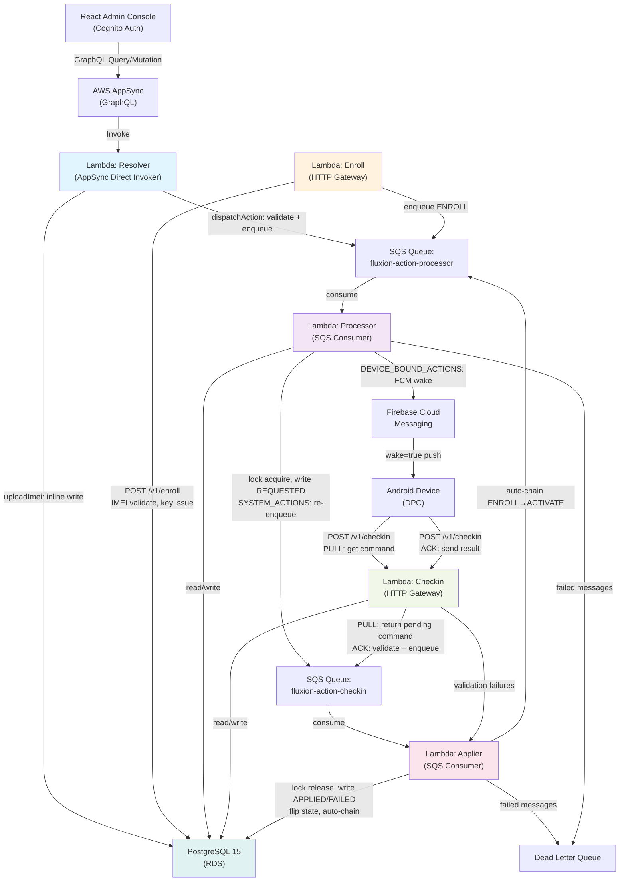
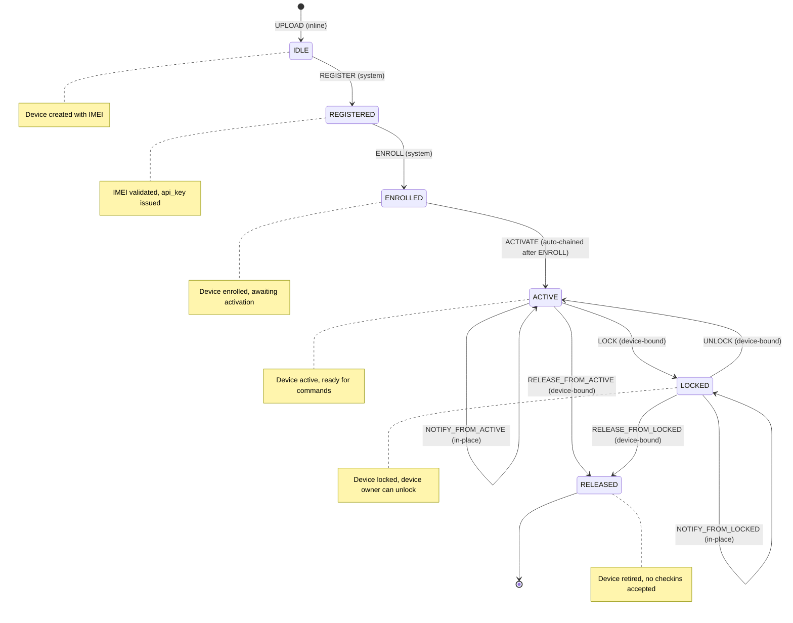
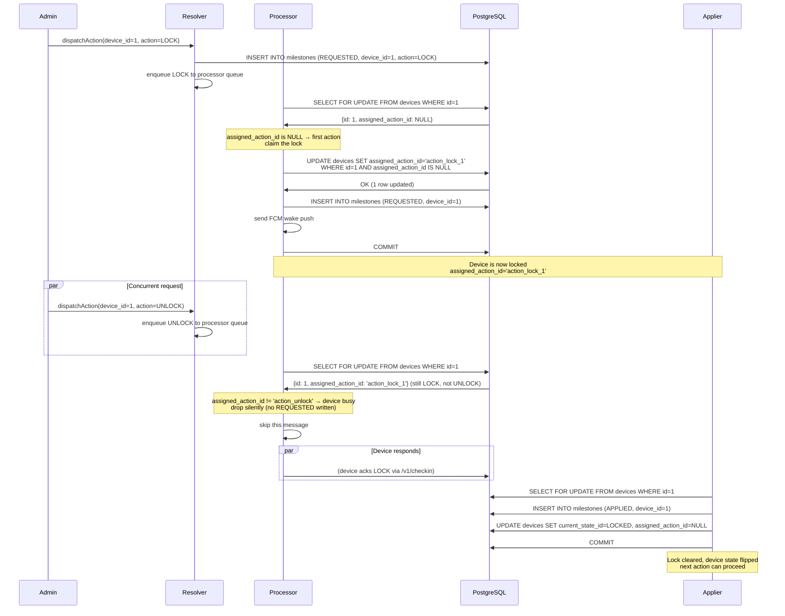
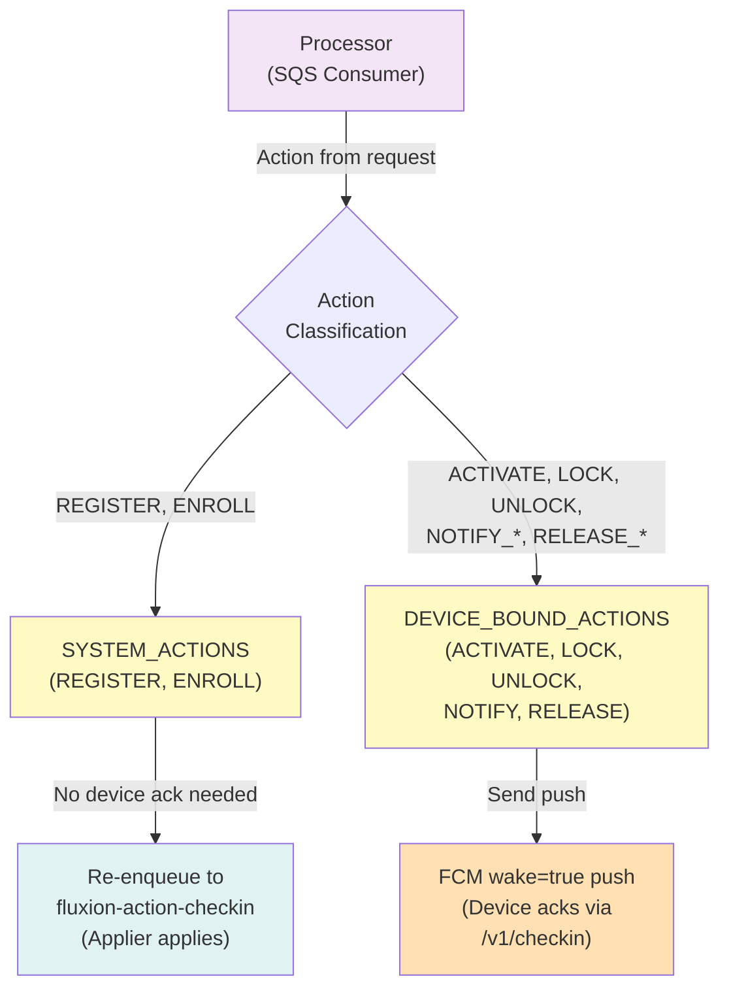
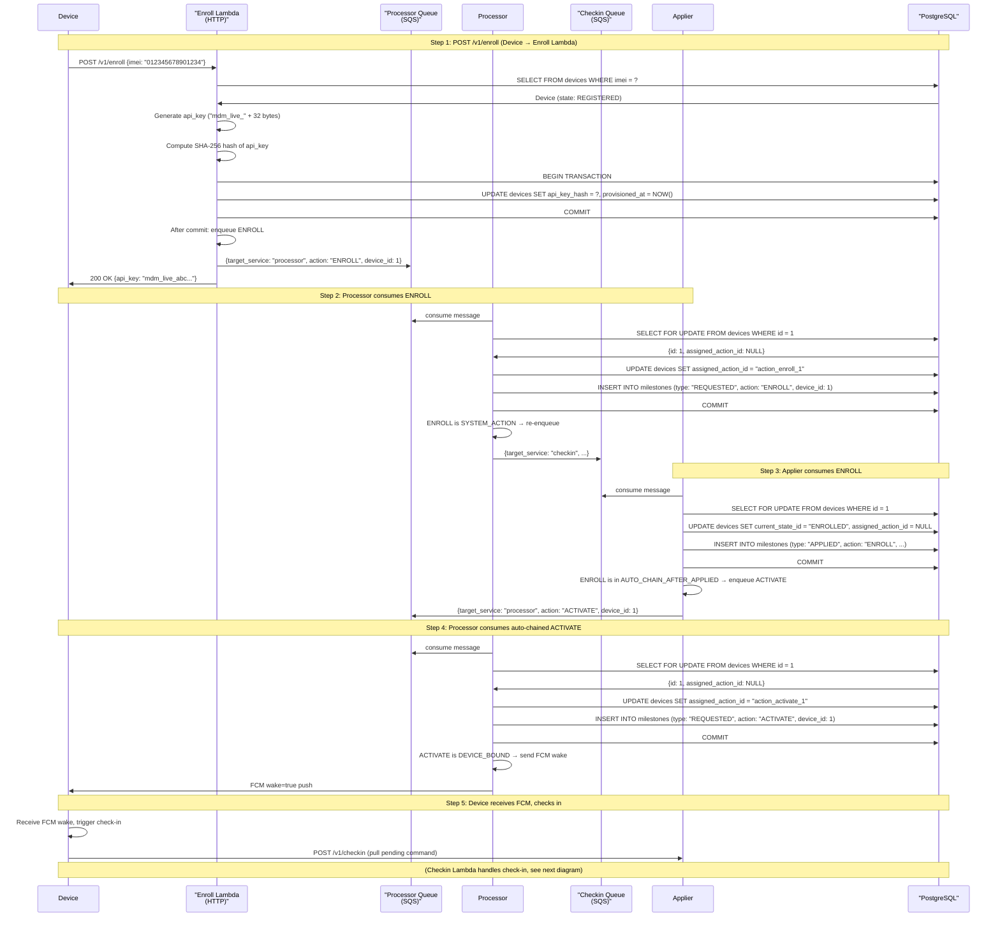
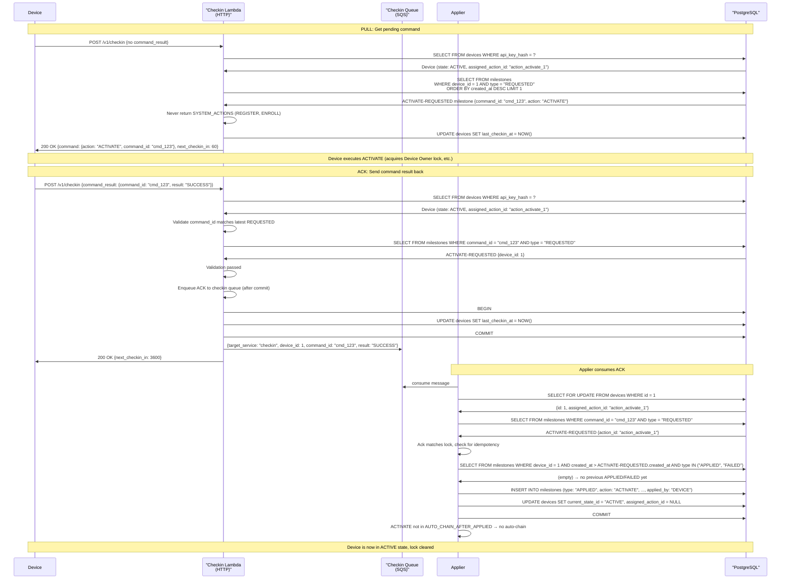
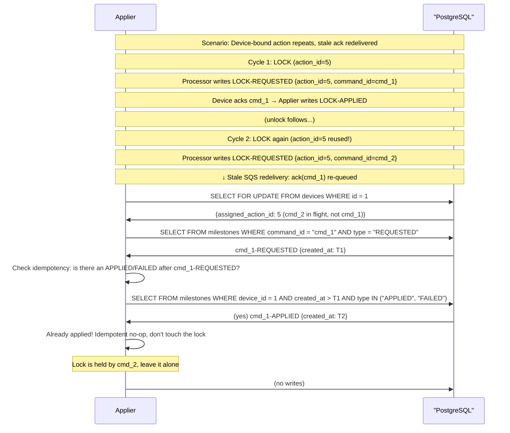

# Fluxion Backend — System Architecture

## Overview

The Fluxion backend is a distributed, event-driven system of five independent Lambda functions coordinating through two SQS queues and a PostgreSQL database to manage a strict device state machine with single-flight concurrency control and complete auditability.

## High-Level Pipeline



## SQS Queue Topology

The backend uses two physical queues instead of one shared queue with filtering:

```mermaid
graph LR
    Resolver["Resolver<br/>(GraphQL)"]
    Enroll["Enroll<br/>(HTTP)"]
    Checkin["Checkin<br/>(HTTP)"]
    
    ProcQueue["fluxion-action-processor<br/>(Request Origin)"]
    CheckinQueue["fluxion-action-checkin<br/>(State Transition)"]
    DLQ["Shared DLQ"]
    
    Processor["Processor<br/>(Consumer)"]
    Applier["Applier<br/>(Consumer)"]
    
    Resolver -->|dispatchAction| ProcQueue
    Enroll -->|enqueue ENROLL| ProcQueue
    Checkin -->|SYSTEM_ACTIONS| CheckinQueue
    
    Processor -->|consumes REQUESTED| ProcQueue
    Processor -->|re-enqueue REGISTER/ENROLL| CheckinQueue
    Processor -->|auto-chain ACTIVATE| ProcQueue
    
    Applier -->|consumes REQUESTED (device-ack)| CheckinQueue
    Applier -->|consumes REQUESTED (server-applied)| CheckinQueue
    
    ProcQueue -->|failed| DLQ
    CheckinQueue -->|failed| DLQ
    
    style ProcQueue fill:#fff9c4
    style CheckinQueue fill:#fff9c4
    style Processor fill:#f3e5f5
    style Applier fill:#fce4ec
```

**Why two queues?** AWS EventSource Mapping (ESM) filtering on a shared queue races: a non-matching ESM marks the message as processed and deletes it **before** the matching ESM can poll. Two queues eliminate the race by ensuring each consumer has its own queue.

## Device State Machine



## Milestone Audit Trail

Every state transition is recorded as an immutable **milestone** row:

```
Device lifecycle (canonical 10-milestone onboarding):
1. UPLOAD (IDLE → IDLE) — UPLOAD-APPLIED [sync, inline]
2. REGISTER (IDLE → REGISTERED) — REGISTER-REQUESTED [processor]
3. REGISTER (same) — REGISTER-APPLIED [applier, system-applied]
4. ENROLL (REGISTERED → ENROLLED) — ENROLL-REQUESTED [processor]
5. ENROLL (same) — ENROLL-APPLIED [applier, system-applied]
6. ACTIVATE (ENROLLED → ACTIVE) — ACTIVATE-REQUESTED [processor, auto-chained]
7. ACTIVATE (same) — ACTIVATE-APPLIED [applier, device-ack]
8. (Device lives in ACTIVE, issuing LOCK/UNLOCK/NOTIFY/RELEASE as needed)
9. RELEASE_FROM_ACTIVE (ACTIVE → RELEASED) — RELEASE_FROM_ACTIVE-REQUESTED [processor]
10. RELEASE_FROM_ACTIVE (same) — RELEASE_FROM_ACTIVE-APPLIED [applier, device-ack]
```

**Milestone schema**:
```sql
CREATE TABLE milestones (
    id SERIAL PRIMARY KEY,
    device_id INTEGER NOT NULL,
    action_id VARCHAR NOT NULL,      -- e.g., "REGISTER", "LOCK"
    command_id VARCHAR NOT NULL,     -- unique per REQUESTED, used for idempotency
    type VARCHAR NOT NULL,           -- "REQUESTED", "APPLIED", "FAILED"
    status VARCHAR,                  -- "SUCCESS" (for APPLIED/FAILED)
    actor VARCHAR,                   -- "OPERATOR", "SYSTEM", "DEVICE"
    applied_by VARCHAR,              -- "DEVICE", "SYSTEM" (for APPLIED only)
    payload JSONB,                   -- action details, command result
    created_at TIMESTAMP NOT NULL,
    FOREIGN KEY (device_id) REFERENCES devices(id)
);

CREATE INDEX ON milestones(device_id, created_at DESC);
CREATE INDEX ON milestones(device_id, action_id, command_id);
```

## Concurrency Model: Single-Flight Lock



## Processor → Applier Routing

The Processor classifies actions and routes them:



## Request Flow: Device Enrollment (ENROLL)



## Request Flow: Device Check-in (PULL + ACK)



## Idempotency: Stale ACK Redelivery



## Lambda Request/Response Examples

### Resolver (GraphQL)

**Request** (AppSync context):
```json
{
  "parentValue": null,
  "args": {"deviceId": 1, "action": "LOCK"},
  "identity": {"claims": {"sub": "user-123"}},
  "request": {"headers": {...}}
}
```

**Handler routes by fieldName**:
- `uploadImei` → `resolvers/device.py:uploadImei()`
- `dispatchAction` → `resolvers/action.py:dispatchAction()`
- `listDevices` → `resolvers/device.py:listDevices()`

**Response**:
```json
{
  "action_id": "action_lock_1",
  "device_id": 1,
  "status": "REQUESTED"
}
```

### Checkin (HTTP)

**PULL Request**:
```json
POST /v1/checkin
Authorization: Bearer mdm_live_abc...
X-Device-IMEI: 012345678901234

{
  "info": {"device_name": "Samsung Galaxy", "os_version": "14.0"}
}
```

**PULL Response**:
```json
{
  "command": {
    "action": "LOCK",
    "command_id": "cmd_123",
    "payload": {}
  },
  "next_checkin_in": 60
}
```

**ACK Request**:
```json
POST /v1/checkin
Authorization: Bearer mdm_live_abc...

{
  "command_result": {
    "command_id": "cmd_123",
    "result": "SUCCESS"
  }
}
```

**ACK Response**:
```json
{
  "next_checkin_in": 3600
}
```

### Enroll (HTTP)

**Request**:
```json
POST /v1/enroll
{
  "imei": "012345678901234"
}
```

**Response**:
```json
{
  "api_key": "mdm_live_def...",
  "device_id": 1
}
```

## Error Handling

All Lambdas raise `AppError` subclasses with UPPER_SNAKE codes:

**AppError hierarchy**:
- `BadRequest` (400) — invalid input (bad IMEI, malformed JSON)
- `Unauthorized` (401) — missing/invalid api_key
- `Forbidden` (403) — device RELEASED
- `NotFound` (404) — device not found
- `Conflict` (409) — device already enrolled
- `InternalError` (500) — database error, unexpected state

**Resolver** (GraphQL error):
```json
{
  "errorType": "AppError",
  "errorMessage": "IMEI must be 15 digits",
  "extensions": {
    "code": "INVALID_IMEI"
  }
}
```

**HTTP Lambdas** (JSON error):
```json
{
  "error_code": "INVALID_IMEI",
  "message": "IMEI must be 15 digits",
  "retry_strategy": {"retry": false}
}
```

**SQS** (batch failures):
```json
{
  "batchItemFailures": [
    {
      "itemId": "message_id_123",
      "reason": "InvalidPayload"
    }
  ]
}
```
