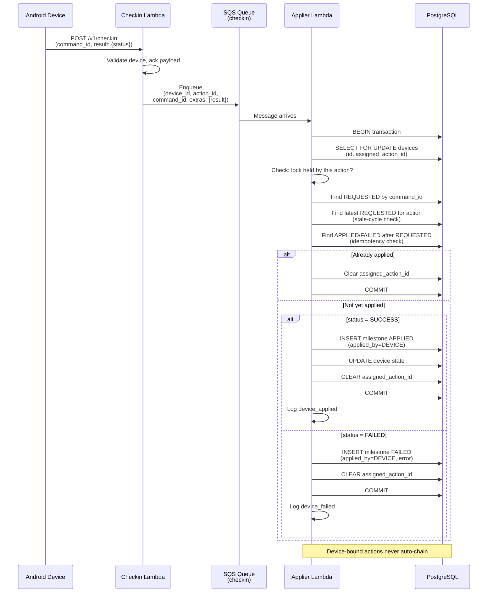
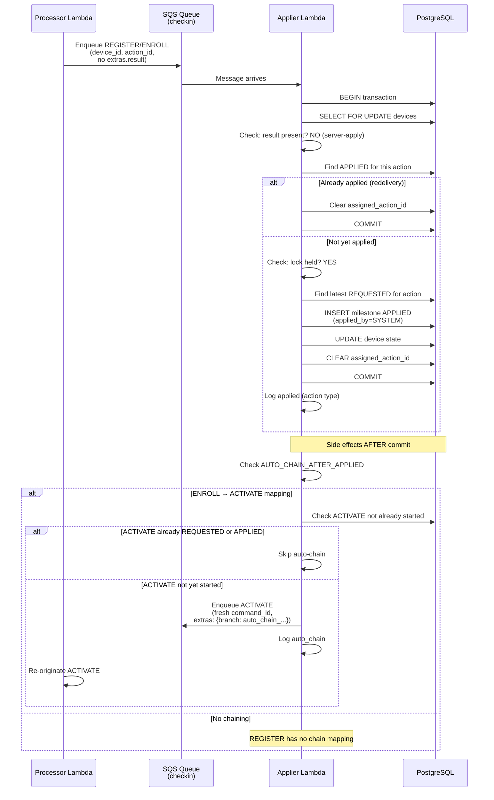

# System Architecture — Applier Module

## Module Position in the Pipeline

The Applier Lambda is the **sole transition writer** in the Fluxion MDM state machine. It consumes the `fluxion-action-checkin` SQS queue and is responsible for writing APPLIED/FAILED milestones, flipping device state, clearing the single-flight lock, and optionally auto-chaining the next action.

```
┌─────────────────────────────────────────────────────────────────────┐
│ FLUXION MDM PIPELINE                                                │
├─────────────────────────────────────────────────────────────────────┤
│                                                                      │
│  Resolver / Enroll / Processor / Checkin                            │
│  (Action Originators)                                               │
│         │                                                            │
│         ├─ dispatchAction (GraphQL) → [processor queue]             │
│         ├─ POST /v1/enroll → [processor queue]                      │
│         └─ Processor (FCM + device ack) → [checkin queue]           │
│                                                                      │
│  ╔═════════════════════════════════════════════════════════════╗   │
│  ║ [fluxion-action-checkin queue]                              ║   │
│  ║ ├─ Device acks (ACTIVATE/LOCK/UNLOCK/NOTIFY/RELEASE)       ║   │
│  ║ └─ Server-applied (REGISTER/ENROLL)                         ║   │
│  ╚═════════════════════════════════════════════════════════════╝   │
│         │                                                            │
│         ↓                                                            │
│  ┌──────────────────────────────────────────────────────────┐      │
│  │ THIS LAMBDA: APPLIER                                    │      │
│  ├──────────────────────────────────────────────────────────┤      │
│  │ 1. Lock device (SELECT FOR UPDATE)                      │      │
│  │ 2. Branch on message type (device-ack vs server-apply)  │      │
│  │ 3. Write APPLIED or FAILED milestone                    │      │
│  │ 4. Flip device state (on SUCCESS only)                  │      │
│  │ 5. Clear assigned_action_id lock                        │      │
│  │ 6. Auto-chain next action if needed (post-commit)       │      │
│  └──────────────────────────────────────────────────────────┘      │
│         │                                                            │
│         ├─ Milestone written to PostgreSQL                          │
│         ├─ Device state flipped                                     │
│         ├─ Lock cleared                                             │
│         └─ [processor queue] (auto-chain ENROLL → ACTIVATE)         │
│                                                                      │
│  Admin / Mobile Client                                              │
│  (Observes via polling)                                             │
│         ←─────────────────────────────────────────────────────      │
│                                                                      │
└─────────────────────────────────────────────────────────────────────┘
```

---

## Message Flow Diagram

### Device-Ack Path (ACTIVATE/LOCK/UNLOCK/NOTIFY/RELEASE)



### Server-Applied Path (REGISTER/ENROLL)



---

## State Machine & Transitions

### Device Lifecycle

```
IDLE
  ↓ [REGISTER]
REGISTERED
  ↓ [ENROLL]
ENROLLED
  ↓ [ACTIVATE]
ACTIVE ← → LOCKED
  ↓ [LOCK]   ↑ [UNLOCK]
LOCKED
  ↓ [RELEASE_FROM_LOCKED]
RELEASED (terminal)

Note: NOTIFY_FROM_ACTIVE and NOTIFY_FROM_LOCKED are in-place states
      (stay in ACTIVE or LOCKED, notify user via push message)
```

**Canonical onboarding:** Exactly 10 milestones
```
1. REGISTER [REQUESTED] → 2. REGISTER [APPLIED]
3. ENROLL [REQUESTED] → 4. ENROLL [APPLIED]
5. ACTIVATE [REQUESTED] → 6. ACTIVATE [APPLIED]
7–10. Additional device-bound actions or notifications
```

### Action Classification

| Category | Examples | Path | Device Ack | Auto-Chain |
|----------|----------|------|------------|------------|
| **System-Applied** | REGISTER, ENROLL | Processor → Applier | None | ENROLL → ACTIVATE |
| **Device-Bound** | ACTIVATE, LOCK, UNLOCK, NOTIFY_*, RELEASE_* | Processor → Device → Checkin → Applier | Required | None |

---

## Concurrency & Lock Management

### Single-Flight Lock Invariant

One action in-flight per device: `devices.assigned_action_id`

```
┌─────────────────────────────────────────────────────────────┐
│ Processor Lambda (Action Originator)                        │
├─────────────────────────────────────────────────────────────┤
│ 1. INSERT milestone REQUESTED                               │
│ 2. UPDATE devices SET assigned_action_id = ? WHERE NULL     │
│    (WHERE clause ensures atomic acquire; no duplicates)     │
│ 3. Send FCM (device-bound) or re-enqueue (server-applied)   │
└─────────────────────────────────────────────────────────────┘
            ↓
┌─────────────────────────────────────────────────────────────┐
│ Applier Lambda (Sole Transition Writer)                     │
├─────────────────────────────────────────────────────────────┤
│ 1. SELECT ... FOR UPDATE devices WHERE id = ?               │
│ 2. Verify assigned_action_id matches this action            │
│ 3. INSERT milestone APPLIED/FAILED                          │
│ 4. UPDATE devices SET assigned_action_id = NULL (CLEAR)     │
│ 5. COMMIT (all durable)                                     │
│ 6. Auto-chain enqueue (if needed)                           │
└─────────────────────────────────────────────────────────────┘
```

### Stale-Cycle Ack Safety

Device-bound actions repeat across lifecycle (LOCK → UNLOCK → LOCK reuse action_id).

**Problem:** SQS redelivery of an UNLOCK ack from the previous UNLOCK cycle could match a newer LOCK cycle's lock (same action_id), corrupting the new cycle.

**Solution:** Device-ack resolution by `command_id`, NOT `action_id`.

```
Cycle 1: LOCK → UNLOCK (command_id = cmd_abc)
  Device acks UNLOCK: POST /v1/checkin(command_id=cmd_abc, result={status: SUCCESS})
  Checkin → Applier: message with command_id=cmd_abc

Cycle 2: LOCK → ? (new lock, new command_id = cmd_xyz)
  SQS redelivers old UNLOCK message (command_id=cmd_abc)
  Applier:
    1. db.find_requested_by_command_id(cmd_abc) → finds old UNLOCK REQUESTED
    2. db.find_latest_requested_for_action(UNLOCK) → finds new LOCK REQUESTED (different)
    3. Stale-cycle check: latest ≠ requested → LOG + RETURN (NO LOCK TOUCHED)

Cycle 2 proceeds unaffected; old cycle's ack is ignored.
```

---

## Idempotency & Eventual Consistency

### Device-Ack Idempotency

Redelivered device acks do not duplicate milestones:

```
First delivery:
  1. Applier receives {command_id=cmd_abc, result={status: SUCCESS}}
  2. db.find_ack_milestone_after() → None
  3. INSERT APPLIED milestone
  4. UPDATE device state
  5. CLEAR lock

Redelivery (same message):
  1. Applier receives {command_id=cmd_abc, result={status: SUCCESS}}
  2. db.find_ack_milestone_after() → APPLIED (created after REQUESTED)
  3. CLEAR lock (idempotent)
  4. RETURN (no duplicate milestone)
```

### Server-Applied Idempotency

Redelivered server-applied messages do not duplicate state flips:

```
First delivery:
  1. Applier receives {device_id=X, action_id=ENROLL, no result}
  2. db.find_applied_milestone() → None
  3. INSERT APPLIED milestone
  4. UPDATE device state to ENROLLED
  5. CLEAR lock
  6. Auto-chain ACTIVATE

Redelivery:
  1. Applier receives {device_id=X, action_id=ENROLL, no result}
  2. db.find_applied_milestone() → APPLIED (exists)
  3. CLEAR lock (idempotent)
  4. Fall through to auto-chain check
  5. db.find_latest_requested_for_action(ACTIVATE) → EXISTS (from first delivery's auto-chain)
  6. SKIP auto-chain (already started)
```

### Auto-Chain Safeguards

Preventing double-chain (ENROLL → ACTIVATE):

```
First delivery:
  1. ENROLL applied, auto-chain check runs
  2. db.find_latest_requested_for_action(ACTIVATE) → None
  3. db.find_applied_milestone(ACTIVATE) → None
  4. Enqueue ACTIVATE (command_id=cmd_fresh_1)

Redelivery of ENROLL:
  1. ENROLL already applied (milestone exists)
  2. Fall through to auto-chain check
  3. db.find_latest_requested_for_action(ACTIVATE) → EXISTS (from first delivery)
  4. SKIP enqueue (already started)

Even if somehow duplicate enqueue occurred:
  → Processor originates ACTIVATE with FOR UPDATE
  → Second origination fails or gets same lock (idempotent at processor level)
```

---

## Transaction Scope & Consistency

All state reads/writes are serialized within a single database transaction:

```python
with db.conn.transaction():
    device = db.lock_device_by_id(device_id)  # SELECT FOR UPDATE
    
    # All reads/writes here are within the lock
    db.insert_milestone(...)
    db.update_device_fields(...)
    
    # Implicit COMMIT on exit; all changes durable
# Side effects AFTER commit (SQS enqueue safe)
```

**Guarantees:**
- Dirty reads: prevented (SELECT FOR UPDATE blocks concurrent writers)
- Lost updates: prevented (UPDATE checks conditions before modifying)
- Phantom reads: prevented (single device lock; no range scans)
- Read consistency: guaranteed within transaction

---

## Service Synchronization

When a device transitions between services (e.g., REGISTER: INVENTORY → DEVICE_FINANCING):

```
BEFORE:
  devices.current_state_id = REGISTERED (service_id = INVENTORY)
  
Action: ENROLL
  target_state_id = ENROLLED (service_id = DEVICE_FINANCING)

APPLIER UPDATE:
  UPDATE devices
    SET current_state_id = ENROLLED,
        service_id = (SELECT service_id FROM states WHERE id = ENROLLED)
  WHERE id = ?

AFTER:
  devices.current_state_id = ENROLLED (service_id = DEVICE_FINANCING)
  
Result: Both columns updated atomically; no drift possible
```

---

## Error Handling & Resilience

### Batch Failure Strategy

SQS allows partial-batch redelivery via `batchItemFailures`:

```json
{
  "batchItemFailures": [
    {"itemIdentifier": "msg-id-1"},
    {"itemIdentifier": "msg-id-3"}
  ]
}
```

**Applier behavior:**
- **Bad JSON:** Batch-fail (redelivery → DLQ after max attempts)
- **target_service != "checkin":** Skip silently (not a failure)
- **Exception in _process_one:** Batch-fail + log (SQS redelivery)
- **Device not found:** Log warning + return (device created elsewhere; idempotent)
- **Stale-cycle ack:** Log info + return (normal; old cycle dropped)

### DLQ & Dead-Letter Handling

Messages with persistent errors go to DLQ (after SQS max receive count):

```
fluxion-action-checkin queue
  ↓ (max receive count exceeded)
fluxion-action-checkin-dlq queue
  ↓ (manual investigation required)
```

---

## Observability & Debugging

### Key Logs (all prefixed `checkin_sqs.`)

| Event | Level | Meaning |
|-------|-------|---------|
| `applied` | INFO | Server-applied action (REGISTER/ENROLL) successfully transitioned |
| `device_applied` | INFO | Device-ack (SUCCESS) successfully transitioned |
| `device_failed` | INFO | Device-ack (FAILED) recorded; no state change |
| `ack_idempotent` | INFO | Device-ack already processed; no duplicate milestone |
| `ack_stale_cycle` | INFO | Device-ack from old cycle of repeating action; ignored |
| `lock_mismatch` | WARNING | Device lock not held by this action; message skipped |
| `auto_chain` | INFO | ENROLL → ACTIVATE queued post-commit |
| `auto_chain_already_started` | INFO | Chained action already has milestone; skip duplicate enqueue |
| `bad_json` | EXCEPTION | Malformed SQS message; batch-failed |
| `device_missing` | WARNING | Device not found; likely app bug (processor should validate) |
| `failure` | EXCEPTION | Uncaught exception in _process_one; batch-failed |

### Metrics to Monitor

- **batchItemFailures rate:** Should be <1% in production (indicates parsing/app bugs)
- **lock_mismatch rate:** Should be near 0 (indicates out-of-order or processor bugs)
- **ack_idempotent rate:** Normal; varies with SQS redelivery patterns
- **P99 message age:** Time from enqueue to processing (should be <5s in normal operation)
- **P99 transaction duration:** Lock hold time (should be <500ms)

---

## Related Documentation

- **Module README:** Overview, message contract, local dev setup
- **Codebase Summary:** Per-file code organization and data flow
- **Code Standards:** Naming, SQL binding, logging format
- **Project Overview PDR:** Functional/non-functional requirements, scope
- **Project Roadmap:** Known limitations, demo phase constraints

---

## Cross-Lambda Context

**Pipeline participants:**
- **Resolver Lambda:** GraphQL dispatch entry point; enqueues to processor
- **Enroll Lambda:** HTTP `/v1/enroll` endpoint; enqueues ENROLL to processor
- **Processor Lambda:** Sole REQUESTED writer; acquires lock; sends FCM or re-enqueues
- **Checkin Lambda:** HTTP `/v1/checkin` ack endpoint; enqueues to applier queue
- **THIS Lambda (Applier):** Sole transition writer (APPLIED/FAILED, state flip, lock clear)

**Two-queue topology (intentional):**
```
fluxion-action-processor queue
  → Processor consumes
  → Sends FCM (device-bound) or re-enqueues to checkin queue (server-applied)

fluxion-action-checkin queue
  → Applier consumes
  → Writes milestones, flips state, clears lock
  → Auto-chain enqueues back to processor (if ENROLL → ACTIVATE)

Shared DLQ for both queues (eventual failure backlog)
```

**Why two queues?** ESM (Event Source Mapping) filtering on a single queue with two consumers races: non-matching consumer deletes first, matching consumer never sees message.
