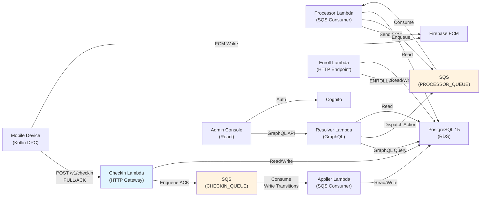
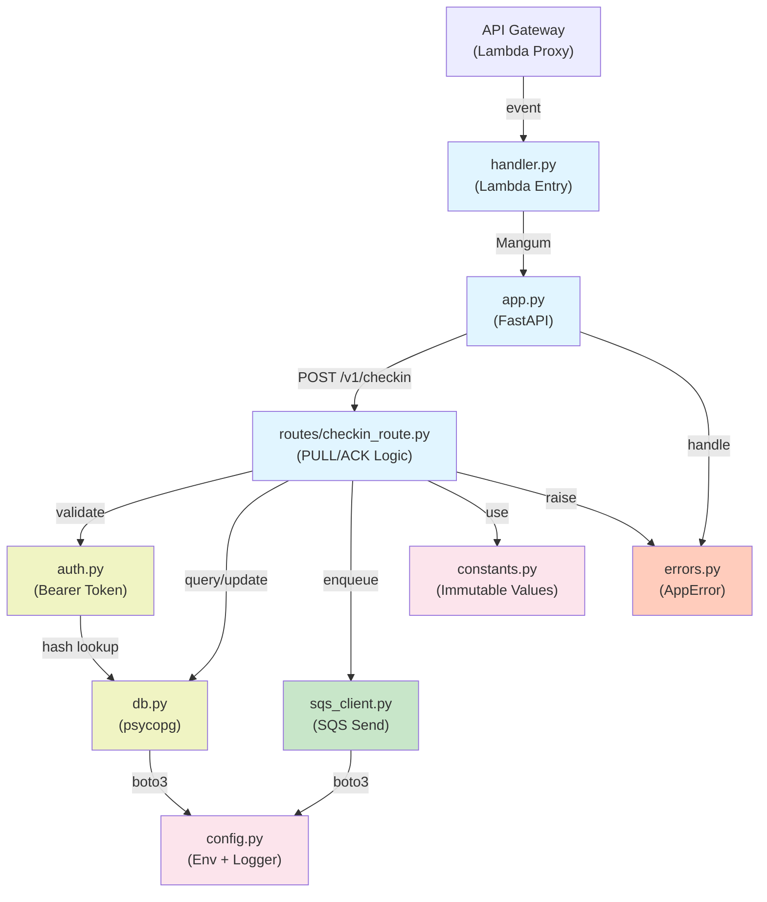

# System Architecture

## Module Context

The **Checkin Lambda** is one of five self-contained Python 3.12 Lambdas in Fluxion's AWS-native MDM platform. It handles device heartbeats and command acknowledgments; state transitions are delegated to the applier Lambda.

### Platform Overview



## Checkin Lambda Architecture

### Component Diagram



## Request Flow — PULL (Heartbeat)

Device requests pending command without acknowledging a prior one.

```mermaid
sequenceDiagram
    participant D as Device
    participant B as Checkin Lambda
    participant DB as PostgreSQL
    participant AP as Applier Lambda

    D->>B: POST /v1/checkin<br/>type: CHECKIN<br/>(no command_result)
    activate B

    B->>DB: SELECT devices WHERE api_key_hash=SHA256(token)
    activate DB
    DB-->>B: device row
    deactivate DB

    alt RELEASED state?
        B-->>D: 403 DEVICE_RELEASED
        deactivate B
    else Valid device
        B->>DB: BEGIN TRANSACTION
        B->>DB: UPDATE devices SET last_checkin_at=NOW(), info=?
        B->>DB: SELECT FROM milestones<br/>WHERE device_id=? AND<br/>action_id=assigned_action_id AND<br/>event_type='REQUESTED'
        activate DB
        DB-->>B: latest REQUESTED
        deactivate DB

        alt assigned_action_id is null
            B-->>D: {command: null, next_checkin_in: 3600}
        else action is SYSTEM_ACTION (REGISTER/ENROLL)
            B-->>D: {command: null, next_checkin_in: 3600}
        else action is DEVICE_BOUND
            B->>DB: SELECT FROM message_templates<br/>WHERE id=? OR<br/>id=action.default_template_id
            activate DB
            DB-->>B: template
            deactivate DB

            B->>DB: COMMIT
            deactivate DB
            B-->>D: {command: {command_id, action_type,<br/>payload: {notification}},<br/>next_checkin_in: 60,<br/>server_time}
        end
    end

    Note over AP: Applier waits for ACK<br/>or timeout to clear lock
```

## Request Flow — ACK (Acknowledgment)

Device reports result of executing a command.

```mermaid
sequenceDiagram
    participant D as Device
    participant B as Checkin Lambda
    participant DB as PostgreSQL
    participant SQS as SQS<br/>CHECKIN_QUEUE
    participant AP as Applier Lambda

    D->>B: POST /v1/checkin<br/>type: CHECKIN<br/>command_result: {command_id,<br/>status: SUCCESS|FAILED, ...}
    activate B

    B->>DB: SELECT devices WHERE api_key_hash=?
    activate DB
    DB-->>B: device row
    deactivate DB

    alt RELEASED state?
        B-->>D: 403 DEVICE_RELEASED
        deactivate B
    else Valid device
        B->>DB: BEGIN TRANSACTION

        B->>DB: UPDATE devices SET last_checkin_at=NOW()
        
        B->>DB: Validate command_result<br/>status ∈ {SUCCESS, FAILED}?
        alt Invalid
            B-->>D: 400 MISSING_FIELD
            deactivate B
        else Valid
            B->>DB: SELECT FROM milestones<br/>WHERE device_id=? AND<br/>payload->>'command_id'=? AND<br/>event_type='REQUESTED'<br/>ORDER BY created_at DESC LIMIT 1
            activate DB
            DB-->>B: requested milestone
            deactivate DB

            alt Not found
                B-->>D: 400 UNKNOWN_COMMAND_ID
                deactivate B
            else Found
                B->>DB: SELECT FROM milestones<br/>WHERE device_id=? AND<br/>action_id=? AND<br/>event_type IN ('APPLIED', 'FAILED') AND<br/>created_at > REQUESTED.created_at
                activate DB
                DB-->>B: ack_milestone or null
                deactivate DB

                alt ack_milestone exists (idempotent)
                    B->>DB: COMMIT
                    B-->>D: {command: null,<br/>next_checkin_in: 3600,<br/>server_time}
                    Note over B,D: Log: idempotent ack
                    deactivate B
                else First ack (not idempotent)
                    B->>DB: COMMIT
                    deactivate DB

                    B->>SQS: POST message<br/>{target_service: checkin,<br/>device_id, action_id,<br/>command_id, result: {...}}
                    activate SQS
                    SQS-->>B: MessageId
                    deactivate SQS

                    B-->>D: {command: null,<br/>next_checkin_in: 3600,<br/>server_time}
                    deactivate B

                    SQS->>AP: Invoke<br/>(SQS event batch)
                    activate AP
                    Note over AP: 1. Find REQUESTED<br/>2. Update device state<br/>3. Insert APPLIED/FAILED<br/>4. Clear assigned_action_id<br/>5. Auto-chain if ENROLL
                    AP->>DB: Transaction: write transitions
                    activate DB
                    DB-->>AP: milestone id
                    deactivate DB
                    deactivate AP
                end
            end
        end
    end
```

## Data Flow — Device State Machine

```mermaid
graph TD
    I["IDLE<br/>(Initial)"]
    R["REGISTERED<br/>(via REGISTER action)"]
    E["ENROLLED<br/>(via ENROLL action)"]
    A["ACTIVE<br/>(via ACTIVATE action)"]
    L["LOCKED<br/>(via LOCK action)"]
    U["UNLOCKED<br/>(via UNLOCK action)"]
    REL["RELEASED<br/>(Terminal)"]

    I -->|REGISTER<br/>server-applied| R
    R -->|ENROLL<br/>device-initiated OR<br/>server-applied| E
    E -->|ACTIVATE<br/>auto-chained after ENROLL| A
    A -->|LOCK<br/>admin-dispatched| L
    L -->|UNLOCK<br/>admin-dispatched| A
    A -->|RELEASE_FROM_ACTIVE| REL
    L -->|RELEASE_FROM_LOCKED| REL
    A -->|NOTIFY_FROM_ACTIVE<br/>in-place| A
    L -->|NOTIFY_FROM_LOCKED<br/>in-place| L

    style I fill:#c8e6c9
    style R fill:#bbdefb
    style E fill:#bbdefb
    style A fill:#fff9c4
    style L fill:#ffccbc
    style REL fill:#f5f5f5,stroke:#999

    linkStyle 0 stroke:#4caf50
    linkStyle 1 stroke:#2196f3
    linkStyle 2 stroke:#2196f3
    linkStyle 3 stroke:#ff9800
    linkStyle 4 stroke:#ff9800
    linkStyle 5 stroke:#ff9800
    linkStyle 6 stroke:#f44336
    linkStyle 7 stroke:#f44336
    linkStyle 8 stroke:#9c27b0
    linkStyle 9 stroke:#9c27b0
```

## Milestone Lifecycle

Every state transition is tracked as an immutable **milestone** (an audit trail entry):

```
Device State: IDLE

┌──────────────────────────────────────────┐
│ Action: REGISTER (SYSTEM_ACTION)         │
│ Requested by: system                     │
└──────────────────────────────────────────┘
                    ↓
┌──────────────────────────────────────────┐
│ Milestone 1: REQUESTED                   │
│ event_type=REQUESTED, from_state=IDLE,   │
│ to_state=REGISTERED                      │
└──────────────────────────────────────────┘
                    ↓
       [Processor consumes from queue]
              [No device ack]
                    ↓
┌──────────────────────────────────────────┐
│ Milestone 2: APPLIED                     │
│ event_type=APPLIED, device_id updated,   │
│ state flipped to REGISTERED              │
└──────────────────────────────────────────┘

Device State: REGISTERED

┌──────────────────────────────────────────┐
│ Action: ACTIVATE (DEVICE_BOUND_ACTION)   │
│ Requested by: processor (auto-chain)     │
└──────────────────────────────────────────┘
                    ↓
┌──────────────────────────────────────────┐
│ Milestone 3: REQUESTED                   │
│ event_type=REQUESTED, command_id=...,    │
│ assigned_action_id set (single-flight)   │
└──────────────────────────────────────────┘
                    ↓
       [Processor sends FCM to device]
       [Device wakes, POST /v1/checkin PULL]
       [Checkin returns command to device]
       [Device executes, POST /v1/checkin ACK]
                    ↓
┌──────────────────────────────────────────┐
│ Milestone 4: APPLIED                     │
│ event_type=APPLIED, status=SUCCESS,      │
│ state flipped to ACTIVE, lock cleared    │
└──────────────────────────────────────────┘

Device State: ACTIVE
```

## SQS Queue Routing

Two physical queues prevent ESM filtering race conditions:

| Queue | Source | Consumer | Message Type |
|-------|--------|----------|--------------|
| `PROCESSOR_QUEUE_URL` | Admin (GraphQL), Enroll Lambda | Processor Lambda | Action dispatch (PROCESSOR target) |
| `CHECKIN_QUEUE_URL` | Checkin Lambda (ACK enqueue) | Applier Lambda | ACK + state transition (CHECKIN target) |

This Lambda only enqueues to `CHECKIN_QUEUE_URL` after ACK validation.

## Authentication & Authorization

### Bearer Token
- Device sends: `Authorization: Bearer mdm_live_<token>`
- Checkin validates: SHA-256 lookup in `devices.api_key_hash`
- Token never logged; hash-only storage

### IMEI Cross-Check (Optional)
- Device sends: `X-Device-IMEI: 123456789012345`
- Checkin verifies: IMEI matches `devices.imei`
- Mismatch → 403 INVALID_DEVICE_BINDING

### Terminal State Rejection
- Device in RELEASED state → All checkins → 403 DEVICE_RELEASED
- No further commands or transitions

## Error Handling & Retry Strategy

All errors return a structured JSON response with retry guidance:

```json
{
  "error_code": "UNKNOWN_COMMAND_ID",
  "message": "No REQUESTED milestone for command cmd-123",
  "retry_strategy": {
    "retryable": false,
    "backoff_seconds": null,
    "max_attempts": null
  }
}
```

| HTTP Status | Retryable | Backoff | Max Attempts | Example |
|-------------|-----------|---------|--------------|---------|
| 4xx (client error) | No | — | — | INVALID_CREDENTIALS, UNKNOWN_COMMAND_ID |
| 5xx (server error) | Yes | 5s | 5 | INTERNAL_ERROR, DB connection failure |

## Concurrency & Locking

### Device Lock
- Checkin acquires `FOR UPDATE` lock during transaction (prevents concurrent applier writes)
- Lock released when transaction commits
- Processor sets `assigned_action_id` (single-flight); applier clears it

### ACK Idempotency Window
- Device-bound actions repeat across lifecycle (e.g., LOCK at ACTIVE, again at LOCKED)
- ACK is idempotent if APPLIED/FAILED milestone exists *after* the matching REQUESTED milestone
- This prevents duplicate state transitions if device retries ACK

Example:
```
Device sends LOCK ack twice with same command_id

1st ACK: No APPLIED/FAILED after REQUESTED → enqueue, applier writes APPLIED
2nd ACK: APPLIED exists after REQUESTED → skip enqueue, log idempotent
```

## Performance Considerations

### Latency
- Target: <100ms median response time (in-region DB)
- No external RPCs in critical path (secrets cached, DB connection reused)

### Throughput
- Connection pooling: single module-global psycopg connection
- Reused across invocations within Lambda lifetime (warm start ~0ms, cold start ~500ms)

### Notification Template Resolution
- Template resolved at checkin time (not applier time)
- Falls back: milestone template_id → action default_template_id → no notification
- Payload cached in milestone for audit trail

## Deployment Topology

```
┌─────────────────────────────────────────┐
│ Fluxion Platform (CDK @ infra/)         │
├─────────────────────────────────────────┤
│ 5 Lambda Functions                      │
├─────────────────────────────────────────┤
│ • Resolver (GraphQL)                    │
│ • Processor (Action dispatch)           │
│ • Enroll (Device enrollment)            │
│ • Checkin (Device gateway) ← THIS       │
│ • Applier (State transitions)           │
├─────────────────────────────────────────┤
│ Shared Infrastructure                   │
├─────────────────────────────────────────┤
│ • PostgreSQL 15 RDS (ap-southeast-1)    │
│ • SQS (2 queues: processor, checkin)    │
│ • Secrets Manager (DB creds, FCM key)   │
│ • CloudWatch Logs                       │
│ • API Gateway (HTTP → Lambda)           │
│ • Cognito (admin auth)                  │
│ • Firebase FCM (device notifications)   │
└─────────────────────────────────────────┘
```

Each Lambda is independently deployed via CDK Docker bundling.
