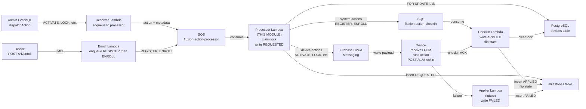
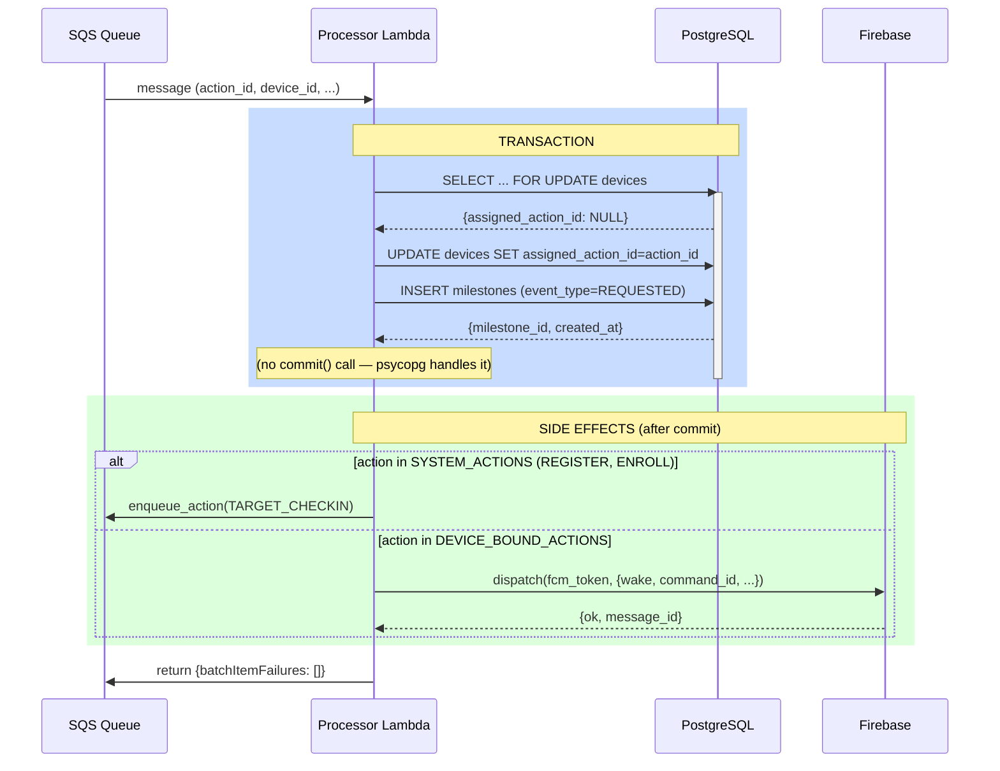
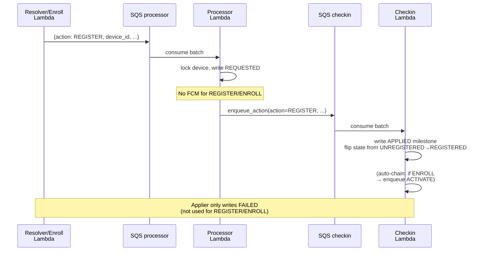
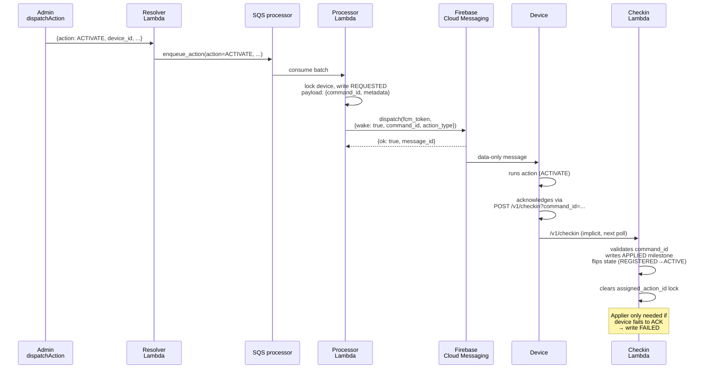

# System Architecture — Processor Lambda

Position in the Fluxion MDM pipeline, concurrency model, and side-effect ordering.

## Pipeline overview

Processor is the **sole request-initiator** for every device action. It sits between the Resolver (enqueuer) and Applier/Checkin (state writers).



## Concurrency model

**Per-device single-flight lock:** PostgreSQL `SELECT ... FOR UPDATE` on devices row.

**Timeline (device D, actions A1, A2):**

```
Timeline:
────────────────────────────────────────────────────

Time T0: A1 arrives
  Lambda-1 acquires FOR UPDATE lock on D
  Lambda-1 sees assigned_action_id=NULL → originate
  Lambda-1 writes REQUESTED for A1
  Lambda-1 releases lock (commit)

Time T1: A1 redelivery (SQS retry)
  Lambda-2 acquires FOR UPDATE lock on D
  Lambda-2 sees assigned_action_id=A1 (same) → skip origination
  Lambda-2 proceeds to route (idempotent)
  Lambda-2 releases lock

Time T2: A2 arrives (while A1 in flight)
  Lambda-3 tries FOR UPDATE lock on D
  Lambda-3 is BLOCKED (waiting for Lambda-1's commit)
  Lambda-3 acquires lock, sees assigned_action_id=A1 (different) → drop
  Lambda-3 logs "device busy", releases lock

Time T3: Applier processes A1
  Lambda-4 acquires lock, writes APPLIED for A1
  Lambda-4 flips device state
  Lambda-4 clears assigned_action_id=NULL
  Lambda-4 releases lock

Time T4: A2 requeued
  Lambda-5 acquires FOR UPDATE lock on D
  Lambda-5 sees assigned_action_id=NULL → originate (finally)
  Lambda-5 writes REQUESTED for A2
  Lambda-5 routes to FCM or checkin
```

**Key invariants:**
- One action in-flight per device at a time
- SQS redeliveries are idempotent (check assigned_action_id)
- Different actions waiting on busy device are dropped silently (no retry)

## Side-effect ordering

**Critical rule:** No side effects until transaction commits.



**Why ordering matters:**
1. If milestone insert fails → exception rolls back, transaction never commits.
2. If transaction commits but FCM fails → milestone is safe, next checkin is fallback wake.
3. If we sent FCM first (before commit) and tx rolled back → misleading FCM without milestone audit trail.

## Sequence: SYSTEM_ACTIONS (REGISTER, ENROLL)



## Sequence: DEVICE_BOUND_ACTIONS (ACTIVATE, LOCK, UNLOCK, NOTIFY, RELEASE)



## Transaction boundaries

**Inside transaction (atomic):**
1. SELECT ... FOR UPDATE on devices
2. Check assigned_action_id for idempotency
3. Query action + template
4. UPDATE assigned_action_id
5. INSERT REQUESTED milestone

**Outside transaction (side effects):**
1. Check action type (SYSTEM_ACTIONS vs DEVICE_BOUND_ACTIONS)
2. If SYSTEM_ACTIONS → enqueue_action(checkin)
3. If DEVICE_BOUND_ACTIONS → fcm_dispatch(fcm_token, payload)

**Error handling:**
- Exception in transaction → psycopg rolls back automatically, message added to batchItemFailures
- Exception in side effects → logged, no retry (message already marked as processed)

## State machine (device perspective)

```
UNREGISTERED
    ↓
    [REGISTER action]
    ↓ (Processor: write REQUESTED)
    ↓ (Checkin: write APPLIED, flip state)
    ↓
REGISTERED
    ↓
    [ENROLL action] ← device-initiated (POST /v1/enroll) OR admin-initiated
    ↓ (Processor: write REQUESTED)
    ↓ (Checkin: write APPLIED, flip state)
    ↓ (Checkin: auto-chain ACTIVATE)
    ↓
    [ACTIVATE action]
    ↓ (Processor: write REQUESTED)
    ↓ (FCM dispatch)
    ↓ (Device ACKs via /v1/checkin)
    ↓ (Checkin: write APPLIED, flip state)
    ↓
ACTIVE
    ├─ [LOCK action] ← Admin can lock
    │   ↓ (Processor: REQUESTED, FCM)
    │   ↓ (Device ACKs)
    │   ↓ (Checkin: APPLIED, state→LOCKED)
    │   ↓
    │   LOCKED
    │   ├─ [UNLOCK] ↔ ACTIVE
    │   ├─ [NOTIFY_FROM_LOCKED]
    │   └─ [RELEASE_FROM_LOCKED] → RELEASED
    │
    ├─ [NOTIFY_FROM_ACTIVE]
    │   ↓ (Processor: REQUESTED, FCM)
    │   ↓ (Device ACKs via /v1/checkin)
    │   ↓ (Checkin: APPLIED, stays ACTIVE)
    │   ↓
    │   ACTIVE (unchanged)
    │
    └─ [RELEASE_FROM_ACTIVE] → RELEASED
        ↓ (Processor: REQUESTED, FCM)
        ↓ (Device ACKs)
        ↓ (Checkin: APPLIED, state→RELEASED)
        ↓
        RELEASED (terminal)
```

**Processor writes only REQUESTED.** Applier and Checkin own state flips.

## Queue topology

**Two queues + shared DLQ:**

| Queue | Consumer | Producer | Message flow |
|-------|----------|----------|--------------|
| `fluxion-action-processor` | Processor | Resolver, Enroll | Actions dispatched by admin or device enrollment |
| `fluxion-action-checkin` | Checkin | Processor | Server-applied actions (REGISTER, ENROLL) for APPLIED write |
| Shared DLQ | (manual inspection) | Both queues | Unprocessable messages (retries exhausted) |

**Why two queues (not one shared)?**
- ESM filter on shared queue races with other Lambdas; two physical queues eliminate race.
- Processor uses SQS filter attribute `target_service` in code (for clarity) but routing is physical queue.

## Deployment topology (AWS)

```
Processor Lambda:
├─ Memory: 512 MB (tunable)
├─ Timeout: 60s (SQS batch timeout)
├─ Concurrency: 100+ (AWS Lambda auto-scales)
├─ SQS Event Source: fluxion-action-processor
│  ├─ Batch size: 10
│  ├─ Batch window: 5s
│  └─ Max concurrency: 100 (Lambda reserved concurrency)
└─ Environment variables:
   ├─ DATABASE_URL | DB_SECRET_ARN + DB_ENDPOINT
   ├─ FIREBASE_SECRET_ARN
   ├─ PROCESSOR_QUEUE_URL
   ├─ CHECKIN_QUEUE_URL
   └─ LOG_LEVEL

Secrets Manager:
├─ fluxion/db (RDS credentials for DATABASE_URL or Secrets fetch)
└─ fluxion/firebase-service-account (Firebase Admin SDK credentials)

PostgreSQL:
├─ devices table (read + FOR UPDATE lock, write assigned_action_id)
├─ actions table (read only)
├─ message_templates table (read only)
└─ milestones table (write REQUESTED only)
```

## Performance characteristics

| Metric | Target | Notes |
|--------|--------|-------|
| **Per-message latency** | <2s | SQS parse + FOR UPDATE + 4 queries + insert + commit |
| **Batch (10 msgs)** | <5s | Concurrent locks (one per device) |
| **FCM dispatch** | <1s | Firebase Admin SDK send |
| **Secrets Manager fetch** | <1s | Cached at module scope; transient failures retry next call |
| **Database connections** | 1 per Lambda (cached) | Double-checked locking, reconnect on broken |
| **Throughput** | 1000s msg/min | Bottleneck is FCM + database lock contention (not Lambda concurrency) |

## Known limits

1. **Max devices** — Unlimited; state machine per-device, no shared resource.
2. **Max concurrent actions** — 1 per device (FOR UPDATE enforces); other actions queued in SQS.
3. **Message size** — SQS limit 256 KB (per message); processor payloads typically <1 KB.
4. **Action types** — 9 types (REGISTER, ENROLL, ACTIVATE, LOCK, UNLOCK, NOTIFY×3, RELEASE×2); extensible via actions table.

