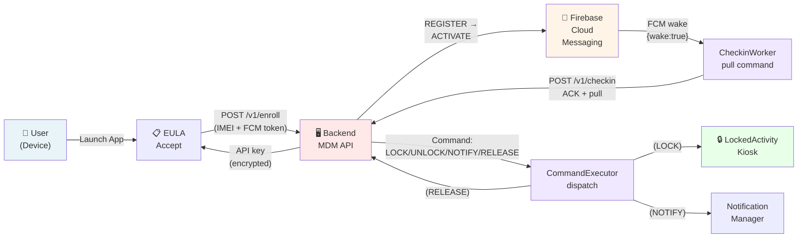
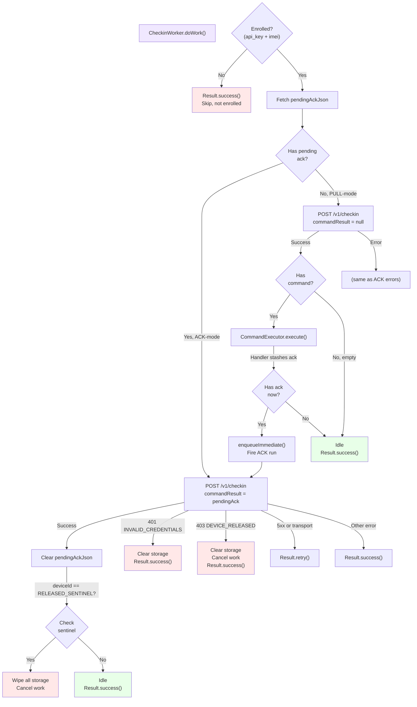
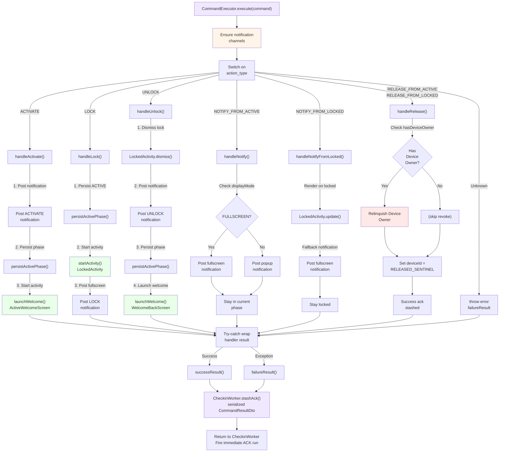
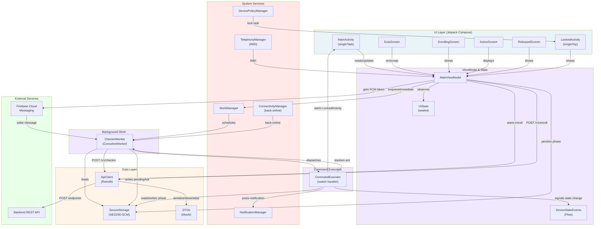
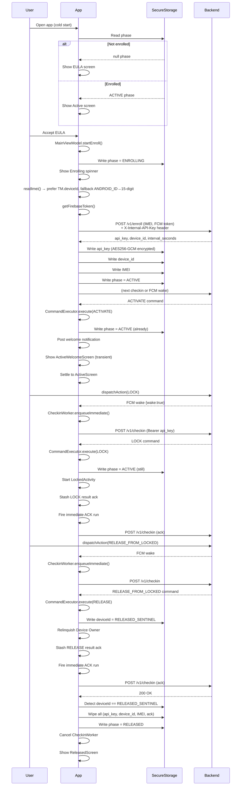
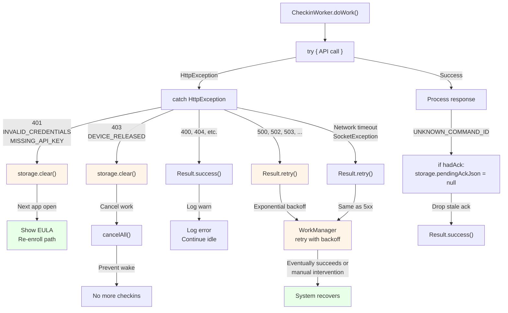
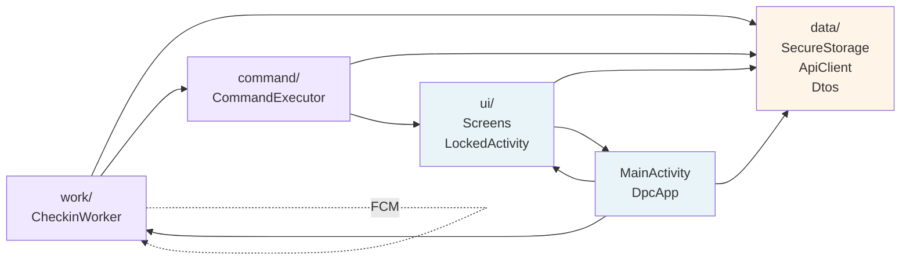
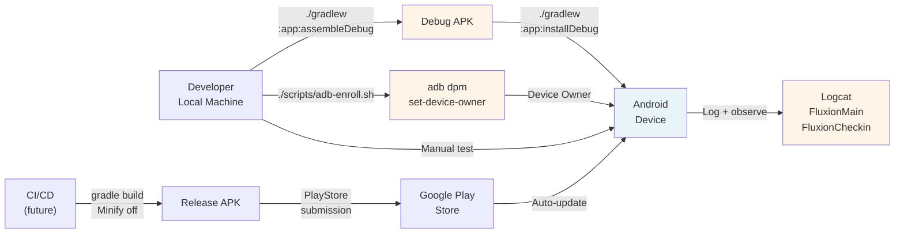

# System Architecture — Fluxion DPC Client

**Version:** 0.3.0 | **Language:** Kotlin + Jetpack Compose | **minSdk:** 28, **targetSdk:** 34

---

## Architecture Overview

**Fluxion DPC** is an event-driven Android Device Policy Controller with NO periodic polling. Commands arrive via Firebase Cloud Messaging (FCM) or are pulled on back-online/app-boot. State persists in AES256-GCM encrypted storage. UI routes based on enrollment phase.

**Key Invariants:**
1. All wake sources funnel through `CheckinWorker.enqueueImmediate()` with REPLACE policy
2. Two-mode checkin: ACK-mode (report result) vs PULL-mode (execute command)
3. Persist phase to storage BEFORE launching activities
4. Welcome flourishes transient (intent extras only, 4 s timeout)
5. RELEASE deferred-cleanup via RELEASED_SENTINEL

---

## High-Level Data Flow



---

## Checkin Loop (Event-Driven)



**Two-Mode Protocol (Invariant):**
- **ACK-mode:** If `pendingAckJson` exists → report result, clear, idle. Never act on response.command.
- **PULL-mode:** If no pending ack → execute response.command (if any) → CommandExecutor stashes ack → fire immediate ACK run.

**Wake Sources** (all funnel to `enqueueImmediate()`):
1. FCM `{wake:true}` data message (FluxionFcmService)
2. Back-online NetworkCallback (DpcApp)
3. App boot if enrolled (MainActivity.onCreate)
4. Post-execute ack flush (CheckinWorker.doWork after execute)

---

## Command Execution & Handler Dispatch



**Key Handlers:**

| Action | Behavior | Phase After |
|--------|----------|-------------|
| **ACTIVATE** | Post welcome, persist ACTIVE, launch ActiveWelcomeScreen | ACTIVE |
| **LOCK** | Persist ACTIVE, start LockedActivity, post fullscreen | ACTIVE (locked) |
| **UNLOCK** | Dismiss LockedActivity, post popup, launch WelcomeBackScreen | ACTIVE |
| **NOTIFY_FROM_ACTIVE** | Post custom notification (POPUP or FULLSCREEN mode) | ACTIVE |
| **NOTIFY_FROM_LOCKED** | Render on locked surface + fullscreen fallback | ACTIVE (locked) |
| **RELEASE_FROM_ACTIVE** | Relinquish Device Owner, set RELEASED_SENTINEL | ACTIVE→RELEASED (after ACK) |
| **RELEASE_FROM_LOCKED** | Same as above | ACTIVE→RELEASED (after ACK) |

---

## UI State Routing

```mermaid
stateDiagram-v2
    [*] --> ReadStorage
    ReadStorage --> Eula: No api_key
    ReadStorage --> Enrolling: Enrolling phase
    ReadStorage --> Active: ACTIVE phase
    ReadStorage --> Released: RELEASED phase
    
    Eula -->|User accepts| PostEnroll[POST /v1/enroll]
    PostEnroll -->|Success| Enrolling
    PostEnroll -->|401 Error| Eula: Show error
    PostEnroll -->|5xx Error| Eula: Show error
    
    Enrolling -->|Checkin pulls ACTIVATE| ActiveWelcome[🎉 ActiveWelcome]
    ActiveWelcome -->|4s timeout| Active: Settle
    
    Active -->|LOCK command| Locked[🔒 LockedActivity]
    Locked -->|UNLOCK command| WelcomeBack[🎉 WelcomeBack]
    WelcomeBack -->|4s timeout| Active: Settle
    
    Active -->|NOTIFY| Active: Stay
    Locked -->|NOTIFY_FROM_LOCKED| Locked: Render on surface
    
    Active -->|RELEASE| ReleasedWait[Ack pending]
    Locked -->|RELEASE| ReleasedWait
    ReleasedWait -->|ACK succeeds + sentinel| Released: Clear storage
    
    Released -->|[nothing]| [*]
    
    Eula -->|onResume re-read| ReadStorage: Cold reopen
    Active -->|onResume re-read| ReadStorage: Cold reopen
    Locked -->|onResume re-read| ReadStorage: Cold reopen (re-lock)
    
    note right of ActiveWelcome
        Transient: intent extra only
        Never persisted
        4s timeout → settle
    end note
    
    note right of ReleasedWait
        deviceId = RELEASED_SENTINEL
        Next ACK-mode run:
        Detect sentinel → wipe storage
    end note
```

**Invariants:**

- **Steady State:** Derived from `SecureStorage.current_phase` on every `onResume`
- **Transient Flourishes:** ActiveWelcome, WelcomeBack are memory-only (intent extras + ViewModel state), never persisted
- **Welcome Timeout:** 4 s (WELCOME_TIMEOUT_MS) before auto-settling
- **Phase Persistence:** Written to storage BEFORE launching activities (survives crashed/dropped background start)

---

## Component Interaction Diagram



---

## Credential & State Lifecycle



---

## Encryption & Security Architecture

```mermaid
graph LR
    User["User Device"]
    
    User -->|Input: IMEI<br/>FCM token| MainVM["MainViewModel<br/>startEnroll()"]
    
    MainVM -->|Plain text<br/>EnrollRequest| Retrofit["Retrofit"]
    Retrofit -->|HTTPS<br/>cleartext=false| Backend["Backend<br/>POST /v1/enroll"]
    
    Backend -->|Plain text<br/>EnrollResponse<br/>api_key, device_id"| Retrofit
    Retrofit -->|Plain text| MainVM
    
    MainVM -->|api_key| Encrypt["Encrypt<br/>AES256-GCM<br/>AndroidKeyStore"]
    Encrypt -->|Ciphertext| SecureStorage["SecureStorage<br/>(EncryptedSharedPref)"]
    
    SecureStorage -->|File: fluxion_secure<br/>Protected by<br/>device lock"| Disk["Device Storage"]
    
    Disk -->|Read + Decrypt| SecureStorage
    SecureStorage -->|Plain text api_key| CheckinWorker["CheckinWorker"]
    
    CheckinWorker -->|Bearer api_key<br/>in Authorization header| CheckinReq["CheckinRequest<br/>HTTPS"]
    CheckinReq -->|cleartext=false| Backend
    
    style User fill:#e8f4f8
    style MainVM fill:#f0e8ff
    style Encrypt fill:#fff4e8
    style SecureStorage fill:#fff4e8
    style Disk fill:#ffe8e8
    style CheckinWorker fill:#f0e8ff
    style CheckinReq fill:#fff4e8
```

**Encryption Details:**

- **Master Key:** AndroidKeyStore AES256-GCM (automatic OS-level rotation)
- **Key Encryption:** AES256_SIV (Deterministic, for consistent re-encryption)
- **Value Encryption:** AES256_GCM (Non-deterministic, random IV per value)
- **Pref File:** "fluxion_secure" (protected by device lock if enabled)
- **Cleartext Traffic:** Disabled globally (`usesCleartextTraffic=false`)
- **HTTPS Only:** All API calls use https:// (enforced at build time)

**Sensitive Fields:**

| Field | Encrypted | Cleared On | Notes |
|-------|-----------|-----------|-------|
| `api_key` | ✅ | 401, DEVICE_RELEASED | Bearer token for checkin |
| `device_id` | ✅ | DEVICE_RELEASED, RELEASE | Set to RELEASED_SENTINEL during release |
| `imei` | ✅ | DEVICE_RELEASED, RELEASE | Sent in X-Device-IMEI header |
| `pending_ack` | ✅ | ACK-mode success, auth error | Serialized CommandResultDto |
| `interval_seconds` | ✅ | DEVICE_RELEASED, RELEASE | Server-provided checkin interval |
| `current_phase` | ✅ | DEVICE_RELEASED, RELEASE | EULA, ENROLLING, ACTIVE, RELEASED |

---

## Device Owner & Lock Architecture

```mermaid
graph TD
    DpcApp["DpcApp.onCreate()"]
    DPM["DevicePolicyManager"]
    
    DpcApp -->|setLockTaskPackages()| DPM
    DPM -->|Set allowlist| OS["Android OS"]
    
    CommandExecutor["CommandExecutor.handleLock()"]
    CommandExecutor -->|startActivity()| LockedActivity["LockedActivity<br/>Kiosk"]
    
    LockedActivity -->|Flags:<br/>NEW_TASK<br/>CLEAR_TASK<br/>showWhenLocked<br/>turnScreenOn| OS
    LockedActivity -->|startLockTask()| LockTask["Lock Task Mode"]
    
    LockTask -->|Shade hidden<br/>Home/back/recents<br/>disabled| Immersive["Immersive<br/>Kiosk Mode"]
    
    CommandExecutor["CommandExecutor.handleUnlock()"]
    CommandExecutor -->|stopLockTask()| LockTask
    LockTask -->|Exit kiosk| Normal["Normal Mode"]
    
    CommandExecutor -->|Relinquish DO| RevokeCheck["Check if<br/>Device Owner"]
    RevokeCheck -->|Yes| RevokeDO["devicePolicyManager<br/>.clearDeviceOwnerApp()"]
    RevokeDO -->|Revoke| OS
    
    OS -->|On revoke| Manifest["Manifest<br/>receiver still intact"]
    
    style DpcApp fill:#f0e8ff
    style DPM fill:#ffe8e8
    style LockedActivity fill:#e8ffe8
    style LockTask fill:#e8ffe8
    style Immersive fill:#e8ffe8
    style RevokeDO fill:#ffe8e8
```

**Device Owner Lifecycle:**

1. **Setup:** `adb-enroll.sh` → `dpm set-device-owner com.fluxion.client/.platform.dpc.FluxionDeviceAdminReceiver`
2. **Allowlist:** DpcApp.onCreate() primes lock-task package allowlist
3. **Lock:** LOCK handler starts LockedActivity → `startLockTask()` enters immersive kiosk
4. **Unlock:** UNLOCK handler → `stopLockTask()` exits kiosk
5. **Release:** RELEASE handler → `clearDeviceOwnerApp()` revokes DO status (optional)
6. **Revoke:** User can revoke from Settings → LockedActivity becomes normal activity (can exit)

---

## FCM & Wake-Up Flow

```mermaid
flowchart TD
    User["Backend<br/>dispatchAction()"]
    FCM["Firebase<br/>Cloud<br/>Messaging"]
    Device["Android<br/>Device"]
    Service["FluxionFcmService<br/>onMessageReceived()"]
    
    User -->|Send data message<br/>{wake: true, ...}| FCM
    FCM -->|Instant delivery<br/>even if sleeping| Device
    Device -->|MESSAGING_EVENT| Service
    
    Service -->|Check 'wake' in data| Check{"Has 'wake'?"}
    Check -->|Yes| Enqueue["CheckinWorker<br/>.enqueueImmediate()"]
    Check -->|No| Ignore["Ignore"]
    
    Enqueue -->|WorkManager<br/>REPLACE policy| WorkMgr["WorkManager"]
    WorkMgr -->|Schedule immediate| Worker["CheckinWorker<br/>.doWork()"]
    Worker -->|POST /v1/checkin<br/>(pull or ack)| Backend["Backend"]
    
    Ignore -->|Lazy checkin<br/>on next FCM or boot| Later["Later..."]
    
    style FCM fill:#e8ffe8
    style Service fill:#f0e8ff
    style Worker fill:#f0e8ff
    style Enqueue fill:#f0e8ff
```

**FCM Trade-offs:**

- **Instant Delivery:** FCM delivers within seconds (verified in Phase 03 test: ≤ 3 s LOCK latency)
- **Reliability:** Google infrastructure guarantees eventual delivery; no local recovery needed
- **Offline:** Message queued by FCM until device back-online
- **Dropped While Online:** If device drops connection mid-download, message is NOT re-sent locally (accepted trade-off; back-online NetworkCallback catches offline→online edge)

---

## Error Recovery & Self-Healing



**Self-Healing Patterns:**

| Error | Handler | Outcome |
|-------|---------|---------|
| **401 (invalid_credentials)** | Clear storage | Next app open → EULA → re-enroll |
| **403 (device_released)** | Clear + cancel work | Terminal; no more checkins |
| **5xx (server error)** | Result.retry() | Exponential backoff; eventually recover |
| **Network timeout** | Result.retry() | Same as 5xx |
| **Unknown command ID** | Drop stale ack | Prevent ack-loop; continue idle |

---

## Concurrency & Synchronization

```mermaid
graph TB
    subgraph MainThread["Main Thread"]
        Activity["Activity/UI"]
        VM["ViewModel"]
        Compose["Compose"]
    end
    
    subgraph WorkThread["WorkManager Thread"]
        Worker["CheckinWorker.doWork()<br/>(suspend)"]
    end
    
    subgraph NetworkThread["Network Thread<br/>(OkHttp)"]
        Retrofit["Retrofit"]
    end
    
    subgraph FileThread["File I/O<br/>(SharedPreferences)"]
        Storage["SecureStorage<br/>(encrypted)"]
    end
    
    Activity -->|collectAsState()| VM
    VM -->|emit()| Compose
    
    VM -->|launchScope<br/>launch| Worker
    
    Worker -->|suspend function<br/>withContext(IO)| Retrofit
    Retrofit -->|blocking call| NetworkThread
    NetworkThread -->|response| Worker
    
    Worker -->|read/write| Storage
    Storage -->|sync| FileThread
    
    Worker -->|emit()<br/>DeviceStateEvents| VM
    VM -->|notify Compose| Compose
    
    style MainThread fill:#e8f4f8
    style WorkThread fill:#f0e8ff
    style NetworkThread fill:#fff4e8
    style FileThread fill:#fff4e8
```

**Thread Safety:**

- **ViewModel → UI:** StateFlow (thread-safe, observed in Compose)
- **WorkManager → Network:** Retrofit handles threading automatically (suspend function)
- **Concurrent Reads:** SecureStorage is thread-safe (EncryptedSharedPreferences wrapped)
- **No Race Conditions:** Single CheckinWorker instance (enqueueImmediate with REPLACE), single ViewModel instance, single Activity (singleTask)

---

## Module Dependencies



---

## Deployment Architecture



---

## Performance Characteristics

| Metric | Target | Observed |
|--------|--------|----------|
| **Checkin Latency (FCM wake to checkin)** | ≤ 3 s | ~1–2 s (Phase 03 test) |
| **Lock Display Latency** | ≤ 3 s | ~1–3 s (end-to-end FCM) |
| **App Launch** | ≤ 500 ms | Cold: ~800 ms, warm: ~100 ms |
| **UI Transition** | ≤ 300 ms | Compose animations: ~200 ms |
| **Notification Render** | ≤ 200 ms | System notification: ~100 ms |
| **Icon Fetch (Coil)** | ≤ 2.5 s | Timeout after 2.5 s; fallback to default |
| **Storage Access (encrypted)** | ≤ 50 ms | Typically < 20 ms |
| **Memory Footprint** | ≤ 100 MB | Baseline: ~60 MB (Compose + Kotlin runtime) |
| **Battery Impact** | ≤ 5% per hour idle | Event-driven: ~1–2% per hour (no polling) |

---

## Extensibility & Future Enhancements

### Planned (Post-MVP)

1. **Automated Tests** — Unit tests for DTOs, encryption round-trips, checkin error cases
2. **Feature Modules** — If additional actions grow beyond current 7 handlers
3. **Certificate Pinning** — OkHttp network security config
4. **Carrier-Privileged IMEI** — Real IMEI path on production devices
5. **Play Integrity** — Replace DPC_INTERNAL_API_KEY with attestation

### Design Constraints (Intentional)

- **No Dependency Injection Framework** — Manual construction sufficient for single module
- **No Periodic Polling** — Event-driven by design; revert requires full architecture refactor
- **Single Gradle Module** — Feature modules only if handler complexity explodes
- **Device Owner Required for Lock** — Can't relax without changing lock mechanism

---

**Last Updated:** 2026-06-07 | **Version:** 0.3.0
