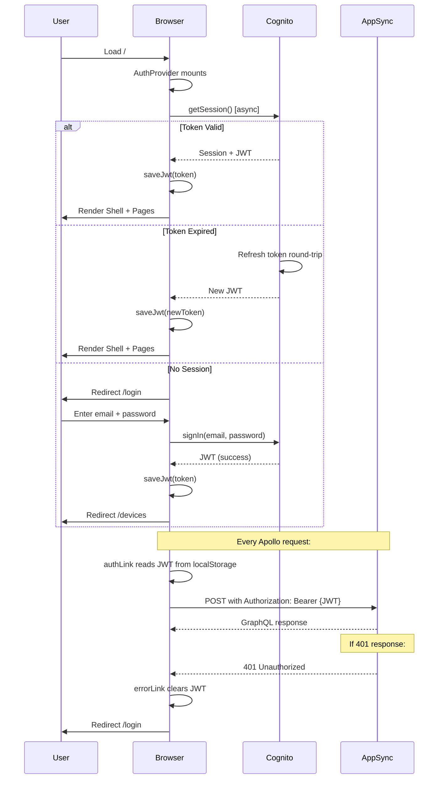
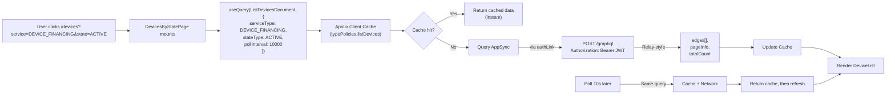
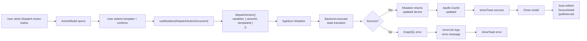

# System Architecture

## Overview

Fluxion Admin Console is a React 18 single-page application (SPA) that communicates with a GraphQL API (AWS AppSync) backed by Python Lambda microservices. The frontend handles authentication via Cognito, state management via Apollo Client, and UI rendering via React + Tailwind.

**Client Stack:** React 18 + Vite 5 + TypeScript 5 + Apollo Client 3 + Tailwind CSS 3.
**Backend:** AWS AppSync (GraphQL) + 5 Python Lambdas + PostgreSQL 15 (Amazon RDS).
**Auth:** Amazon Cognito (user pool, SRP sign-in via amazon-cognito-identity-js — no Hosted UI/OAuth).
**Deployment:** Frontend: no hosting infra yet (runs locally against the deployed backend); Backend: Lambda + AppSync + API Gateway via CDK.

---

## High-Level Architecture

```
┌─────────────────────────────────────────────────────────────┐
│                     Browser (User)                          │
│                                                             │
│  ┌───────────────────────────────────────────────────────┐ │
│  │              Fluxion Admin Console                    │ │
│  │                                                       │ │
│  │  ┌─────────┐  ┌──────────┐  ┌────────────────────┐  │ │
│  │  │  React  │  │  Apollo  │  │   Cognito SDK      │  │ │
│  │  │Component│  │  Client  │  │   (JWT in LS)      │  │ │
│  │  │  Tree   │  │          │  │                    │  │ │
│  │  └─────────┘  └──────────┘  └────────────────────┘  │ │
│  └───────────────────────────────────────────────────────┘ │
└────────────────┬─────────────────────────────────────────────┘
                 │
         ┌───────┴───────────────┐
         │                       │
         │ HTTPS                 │ HTTPS
         ▼                       ▼
┌─────────────────┐     ┌──────────────────┐
│ AppSync GraphQL │     │ Cognito IDP      │
│   Endpoint      │     │ (SRP sign-in)    │
└─────────────────┘     └──────────────────┘
         │
         │ (Backend)
         ▼
┌─────────────────────────────────────────────────────┐
│  5 Python Lambdas + PostgreSQL (RDS) + SQS + FCM    │
│  (not shown here — see root README)                 │
└─────────────────────────────────────────────────────┘
```

---

## Frontend Architecture

### Component Hierarchy

```
App (Routes)
├── /login
│   └── LoginPage
│
└── / (ProtectedRoute)
    └── Shell (Main Layout)
        ├── Sidebar (NavGroups)
        │   ├── Devices
        │   │   ├── Inventory (IDLE)
        │   │   └── Device Financing (REGISTERED..RELEASED)
        │   └── Configuration (States, Actions, Templates, TACs)
        ├── Outlet (Page Content)
        │   ├── DevicesByStatePage
        │   ├── DeviceDetailPage
        │   ├── UploadImeiPage / UploadHistoryPage
        │   ├── ConfigStatesPage / ConfigActionsPage
        │   ├── TemplatesPage
        │   └── TacsPage
        └── Footer (User Email, Sign Out)
```

### State Management Flow

```
┌────────────────────────────────────────────────┐
│           AuthProvider (Context)               │
│                                                │
│  session: CognitoSession | null                │
│  signIn(username, password) → Promise<void>    │
│  signOut() → void                              │
│  loading: boolean                              │
│                                                │
│  Initializes: currentSession() on mount        │
│  (async refresh if token expired)              │
└────────────────────────────────────────────────┘
         │
         │ (useAuth())
         ▼
┌────────────────────────────────────────────────┐
│         Apollo Client                          │
│                                                │
│  Cache: InMemoryCache with typePolicies        │
│  watchQuery: cache-and-network                 │
│  pollInterval: 10s (device pages)              │
│                                                │
│  Link Chain:                                   │
│  1. errorLink (401 → clear JWT + redirect)     │
│  2. authLink (inject JWT in header)            │
│  3. httpLink (AppSync endpoint)                │
└────────────────────────────────────────────────┘
         │
         │ (useQuery / useMutation)
         ▼
┌────────────────────────────────────────────────┐
│      Page Components (React)                   │
│                                                │
│  Local state (useState) for UI:                │
│  - Forms (upload, search)                      │
│  - Modals (dispatch action)                    │
│  - Pagination (cursor-based)                   │
│  - Filters (?service=, ?state=)                │
└────────────────────────────────────────────────┘
```

---

## Authentication Flow



---

## GraphQL Data Flow

### Query Execution (Device List Example)



### Mutation Execution (Dispatch Action Example)



---

## Key Architectural Decisions

### 1. Polling Over Subscriptions (MVP)
**Decision:** 10s poll via cache-and-network (no GraphQL subscriptions).

**Rationale:**
- Simpler to implement (no WebSocket stateful connection).
- Sufficient for operator workflows (10s latency acceptable).
- Avoids subscription cost/complexity in phase 1.

**Implementation:**
```typescript
useQuery(ListDevicesDocument, {
  pollInterval: 10000,  // 10s
  fetchPolicy: "cache-and-network",  // Return cache, then refresh
})
// Do NOT set nextFetchPolicy: 'cache-first' — would kill polling
```

---

### 2. JWT in localStorage (With CSP Mitigation)
**Decision:** Store Cognito JWT in localStorage (key: `fluxion.jwt`).

**XSS Risk:** localStorage is accessible to any inline JavaScript (XSS vulnerability).

**Mitigation:** Strict Content Security Policy in production.
```html
<!-- index.html -->
<meta http-equiv="Content-Security-Policy" 
      content="default-src 'self'; script-src 'self'; ..." />
```

**Tradeoff Accepted:** Documented in phase-04 security review. Alternative (HttpOnly cookie) requires server-side session management.

---

### 3. Async Token Refresh
**Decision:** currentSession() is async (Cognito SDK callback may trigger refresh round-trip).

**Critical Detail:** Earlier code assumed synchronous session check → spurious logouts after 1h (when access token expired).

**Fix:**
```typescript
// src/auth/cognito.ts
export function currentSession(): Promise<CognitoSession | null> {
  const user = pool.getCurrentUser();
  if (!user) return Promise.resolve(null);
  return new Promise((resolve) => {
    user.getSession((err, session) => {
      if (err || !session?.isValid()) { 
        resolve(null); 
        return; 
      }
      resolve({ idToken, username, email });
    });
  });
}
```

---

### 4. Relay-Style Pagination
**Decision:** Use Relay cursor-based pagination (endCursor, hasNextPage).

**Rationale:**
- Stable across insertions/deletions (unlike offset-limit).
- Works with real-time updates (cursor points to exact position).
- Standard GraphQL pattern.

**Usage:**
```typescript
useQuery(ListDevicesDocument, {
  variables: { first: 20, after: null },
  // Fetch next page:
  // after: pageInfo.endCursor
})
```

---

### 5. Action Availability Filtering
**Decision:** availableActions() filters by fromState.service (not action.service).

**Why:** Allows transition actions to appear during onboarding.

**Example:** REGISTER action has fromState=IDLE (Inventory service), targetState=REGISTERED (Device Financing service). REGISTER must appear on an Inventory device, so keying by fromState.service is correct.

```typescript
export function availableActions(device: Device, all: Action[]): Action[] {
  return all.filter((a) =>
    a.actor === "OPERATOR" &&
    a.fromState?.type === device.currentState.type &&
    a.fromState?.service.type === device.service.type,  // Key by fromState service
  );
}
```

---

### 6. Single-Flight Concurrency Control
**Decision:** If device.assignedAction is non-null, disable action dispatch UI.

**Rationale:** Prevents duplicate commands in-flight; backend is single-threaded per device.

```typescript
export function isDispatchDisabled(device: Pick<Device, "assignedAction">): boolean {
  return !!device.assignedAction;
}

// UI (ActionDispatchPanel):
<select disabled={isDispatchDisabled(device)}>
```

---

### 7. Vite + React CSP Relax Strategy
**Decision:** Dev CSP permissive (HMR needs inline scripts); prod CSP strict.

**Implementation:** vite.config.ts relaxCspInDev plugin.

```typescript
function relaxCspInDev(): Plugin {
  return {
    name: "fluxion-csp-dev",
    apply: "serve",
    transformIndexHtml(html) {
      return html.replace(
        /<meta http-equiv="Content-Security-Policy"[\s\S]*?\/>/,
        `<meta ... content="... script-src 'self' 'unsafe-inline' 'unsafe-eval' ..." />`
      );
    },
  };
}
```

---

### 8. Cognito SDK CJS Polyfill
**Decision:** Define global = globalThis in vite.config.ts.

**Why:** Cognito SDK ships a CommonJS bundle that references Node's `global` object. Browser has no `global` → module throws at import time.

```typescript
export default defineConfig({
  define: {
    global: "globalThis",
  },
});
```

---

## Data Model & State Machine

### Device State Machine

```
┌──────────────────────────────────────────────────────────────┐
│                    Device Services                           │
├──────────────────────────────────────────────────────────────┤
│  INVENTORY           │  DEVICE_FINANCING                     │
├──────────────────────┼───────────────────────────────────────┤
│  IDLE                │  REGISTERED → ENROLLED → ACTIVE        │
│                      │                          ↑  ↓          │
│                      │                        LOCKED          │
│                      │                          ↓  ↑          │
│                      │                       → ACTIVE          │
│                      │                          ↓              │
│                      │                       RELEASED         │
└──────────────────────┴───────────────────────────────────────┘
```

### Action Types
- **OPERATOR:** User-initiated (visible in action dropdown when available).
- **SYSTEM:** Backend-initiated (never user-dispatchable).

### Milestone Records
Every state transition creates an immutable milestone:
```graphql
{
  id: ID!
  eventType: MilestoneEventType  # StateTransition, TemplateSelected, etc.
  payload: String                # JSON: {fromState, toState, actor, reason}
  action: Action                 # Dispatched action (if any)
  fromState: State               # Source state
  toState: State                 # Target state
  requestedBy: User              # Who triggered (OPERATOR | SYSTEM)
  createdAt: DateTime
}
```

---

## Configuration & Environment

### Env Vars (Build-Time)
Centralized in `src/env.ts` (required; build fails if missing):

```typescript
export const env = {
  region: "ap-southeast-1",                          // VITE_AWS_REGION
  userPoolId: "ap-southeast-1_xxxxx",                // VITE_COGNITO_USER_POOL_ID
  userPoolClientId: "xxxxx",                         // VITE_COGNITO_USER_POOL_CLIENT_ID
  appsyncUrl: "https://xxxxx.appsync-api.ap-southeast-1.amazonaws.com/graphql",
};
```

**Source:** `infra/cdk-outputs.json` (CDK deploy output); manually copied to `.env`.

### Tailwind Design Tokens
- **Source of Truth:** `tailwind.config.ts`.
- **Mirrored in:** `src/styles/tokens.css` (@layer components).
- **Colors:** Editorial Cream (#ebe2cc sidebar, #f4f1ea bg) + Terracotta accent (#c44a2c).
- **Fonts:** Inter (sans), JetBrains Mono (mono).

---

## Error Handling Strategy

### Apollo Error Link

```typescript
const errorLink = onError(({ graphQLErrors, networkError }) => {
  // 401: Unauthorized (JWT expired or invalid)
  if (networkError?.statusCode === 401) {
    clearJwt();
    window.location.assign("/login");
  }
  
  // GraphQL errors (logged to console)
  if (graphQLErrors) {
    for (const err of graphQLErrors) {
      console.warn("[gql]", err.message, err.path);
    }
  }
});
```

### Component Error Handling
- Mutations: catch Promise rejection, show error toast.
- Queries: render error boundary or empty state.
- Cognito auth errors: show login error message.

---

## Performance Considerations

### Cache Strategy
- InMemoryCache with typePolicies for list operations.
- Prevents redundant queries when navigating between pages.
- Manual refetch not needed (polling handles freshness).

### Polling Optimization
- 10s interval; conservative (avoids API overload).
- cache-and-network: instant UI update (cache), then background refresh.
- Do NOT use cache-first: would disable polling after first response.

### Build Optimization
- Vite tree-shaking (production build).
- React strict mode removed in production.
- CSS minified by Tailwind + PostCSS.
- GraphQL type definitions stripped from dist (TypeScript compile-time only).

---

## Deployment & Infrastructure (Context Only)

**Frontend Deployment:**
- Build: `npm run build` → `dist/` (static files).
- Host: none provisioned yet — console runs via `npm run dev` / `npm run preview` against the deployed backend. Hosting is post-MVP (`infra/` workspace).
- CSP: Strict in production build (script-src 'self').

**Backend (Out of Scope for Frontend Docs):**
- GraphQL: AWS AppSync (Resolver Lambda direct resolvers).
- Compute: 5 Python 3.12 Lambdas (Resolver, Processor, Enroll, Checkin, Applier) driving the device state machine.
- Storage: PostgreSQL 15 on Amazon RDS (devices, milestones, config); SQS queues + FCM for command delivery.

**CI/CD (Implicit):**
- Post-CDK-deploy: copy env vars from cdk-outputs.json to .env.
- Frontend build: tsc + vite build.
- Tests: vitest run (before deploy).

---

## Last Updated

2026-06-07
