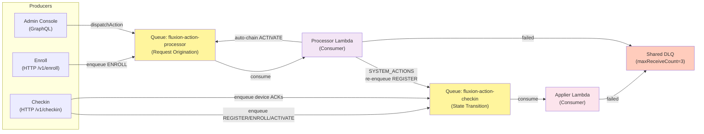
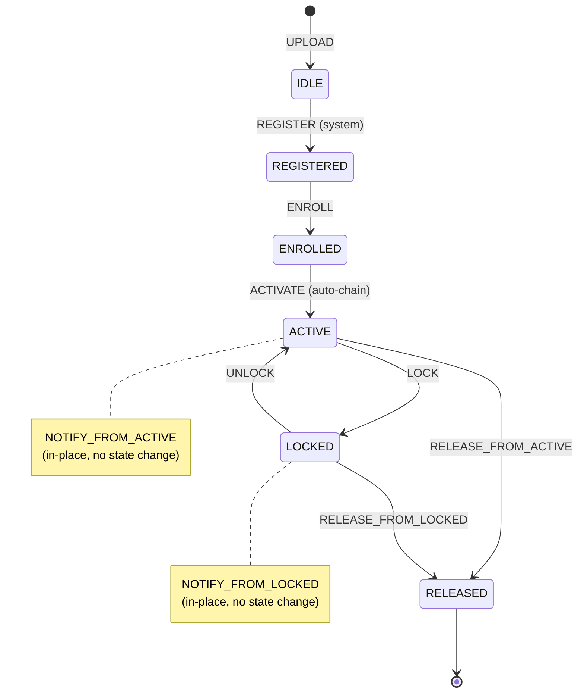
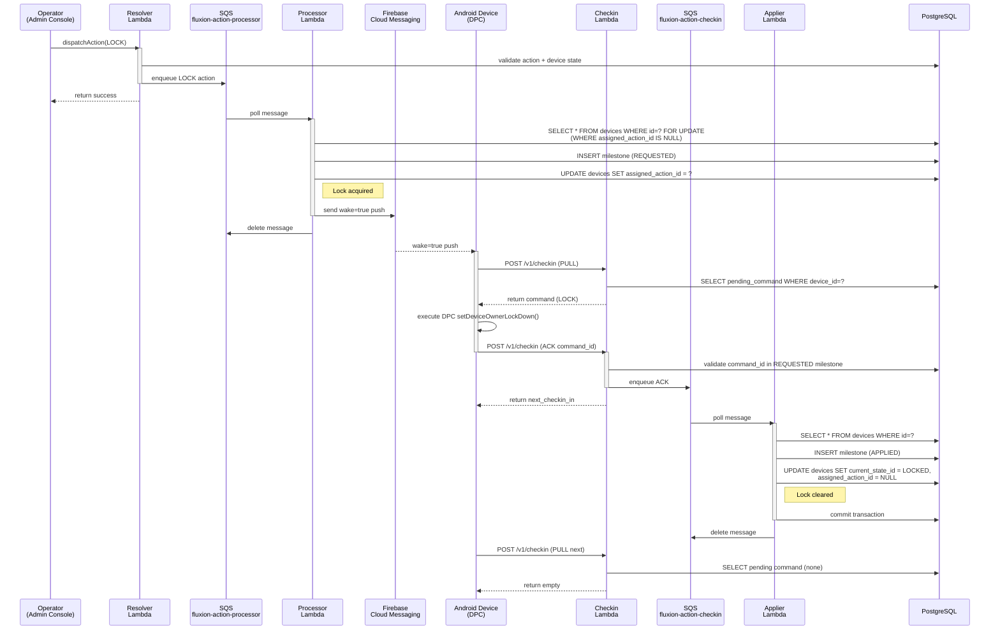
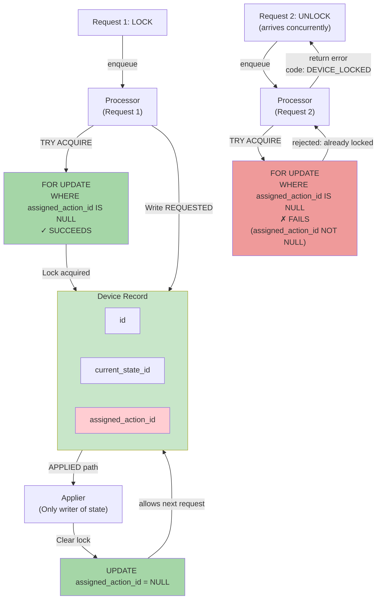

# Fluxion Platform — System Architecture

## High-Level Overview

Fluxion is a serverless, event-driven MDM platform composed of five independent Lambda functions coordinating through two SQS queues, PostgreSQL, and Firebase Cloud Messaging. The system enforces strict device state serialization via database-level locks and provides complete auditability through immutable milestone records.

---

## Control Plane vs. Device Plane

```mermaid
graph TB
    subgraph ControlPlane["CONTROL PLANE (Operators)"]
        AdminConsole["React Admin Console<br/>(Cognito Auth, Vite)"]
        AppSync["AWS AppSync<br/>(GraphQL + Subscriptions)"]
    end
    
    subgraph BackendStack["BACKEND STACK (Serverless)"]
        Resolver["Resolver Lambda<br/>(AppSync Direct)"]
        Processor["Processor Lambda<br/>(SQS fluxion-action-processor)"]
        Applier["Applier Lambda<br/>(SQS fluxion-action-checkin)"]
    end
    
    subgraph DevicePlane["DEVICE PLANE (DPC Devices)"]
        Enroll["Enroll Lambda<br/>(HTTP /v1/enroll)"]
        Checkin["Checkin Lambda<br/>(HTTP /v1/checkin)"]
        FCM["Firebase Cloud<br/>Messaging"]
        Device["Android Device<br/>(DPC)"]
    end
    
    subgraph DataLayer["DATA LAYER"]
        DB["PostgreSQL 15<br/>(RDS)"]
        Queue1["SQS fluxion-action-processor"]
        Queue2["SQS fluxion-action-checkin"]
        DLQ["Shared DLQ"]
    end
    
    AdminConsole -->|GraphQL Query/Mutation| AppSync
    AdminConsole -->|WebSocket (Cognito JWT)<br/>Real-time Subscriptions| AppSync
    AppSync -->|Invoke| Resolver
    
    Resolver -->|uploadImei: inline UPLOAD-APPLIED| DB
    Resolver -->|dispatchAction: validate + enqueue| Queue1
    Resolver -->|post-commit: IAM publish| AppSync
    
    Enroll -->|POST /v1/enroll<br/>IMEI validate, api_key issue| DB
    Enroll -->|enqueue ENROLL| Queue1
    
    Queue1 -->|consume| Processor
    Processor -->|lock acquire, write REQUESTED| DB
    Processor -->|post-commit: IAM publish| AppSync
    Processor -->|SYSTEM_ACTIONS: re-enqueue| Queue2
    Processor -->|DEVICE_BOUND_ACTIONS: FCM wake| FCM
    
    Queue2 -->|consume| Applier
    Applier -->|lock release, write APPLIED/FAILED<br/>flip state, auto-chain| DB
    Applier -->|post-commit: IAM publish| AppSync
    
    FCM -->|wake=true push| Device
    Device -->|POST /v1/checkin<br/>PULL pending command| Checkin
    Device -->|POST /v1/checkin<br/>ACK command result| Checkin
    
    Checkin -->|validate ACK + enqueue| Queue2
    Checkin -->|read device state| DB
    
    Queue1 -->|failed| DLQ
    Queue2 -->|failed| DLQ
    
    style ControlPlane fill:#e3f2fd
    style BackendStack fill:#f3e5f5
    style DevicePlane fill:#e8f5e9
    style DataLayer fill:#fff9c4
```

---

## Real-Time Push via AppSync Subscriptions

Device state changes occur out-of-band in the SQS Lambdas (Processor, Applier) and Resolver mutations — they write PostgreSQL directly, bypassing AppSync. To notify the admin console in real-time instead of relying solely on 10-second polling, the backend publishes lightweight change-events after each state mutation commits:

**Architecture:**
- **IAM-only broadcast mutations** (`publishDeviceChange`, `publishDeviceUploadChange`) backed by NONE data sources and JavaScript passthrough resolvers. These mutations trigger AppSync subscriptions.
- **Publish points** (all post-transaction-commit, never inside):
  - Processor: publishes REQUESTED milestone (action claimed, lock acquired)
  - Applier: publishes APPLIED/FAILED milestone (action completed, lock released)
  - Resolver uploadImei: publishes both device + upload change events
- **Payload design**: Scalar-only change-events (deviceId, imei, eventType, at) rather than full Device objects. AppSync subscriptions deliver exactly the triggering mutation's payload; nested field resolvers do not re-run on push. Embedding full nested graphs would force Lambdas to reconstruct complex joins.
- **Fallback**: The 10-second polling interval on all data-fetching pages is retained as a fallback for robustness.

**Authentication:**
- Publisher Lambdas (Resolver, Processor, Applier) authenticate via **AWS SigV4/IAM** (already a dependency via boto3).
- Admin console subscribers authenticate via **Cognito JWT over WebSocket** (existing auth mode).
- AppSync API now has **IAM as an additional auth mode** alongside the default Cognito USER_POOL.

**Frontend integration:**
- Apollo Client uses a `split` link routing subscriptions over WebSocket (via `aws-appsync-subscription-link` v3 with Cognito JWT).
- Pages (DeviceDetail, DevicesByState, UploadHistory) use `useSubscription` hooks to listen for push events and refetch the affected query on receipt.
- CSP `connect-src` extended to allow the AppSync realtime WebSocket origin (`wss://`).

**Guarantees:**
- Never raises: publish failures (IAM, network, endpoint) are swallowed; if AppSync is unavailable, the next 10s poll catches the state.
- Push is best-effort; polling is the source of truth for operators unable to observe the push window.

---

## The Five Lambdas

| Lambda | Trigger | Role | Writes | Real-Time Push | Acquires Lock? |
|--------|---------|------|--------|---|--|
| **Resolver** | AppSync direct | GraphQL dispatcher; dispatches to `resolvers/{entity}.py` per fieldName | UPLOAD-APPLIED (inline); enqueues mutations to SQS | Publishes device + upload change (post-commit) | — |
| **Processor** | SQS `fluxion-action-processor` | Sole request originator; writes REQUESTED milestone; routes to FCM or re-enqueue | REQUESTED milestone | Publishes device change (post-commit) | **YES** (FOR UPDATE WHERE assigned_action_id IS NULL) |
| **Enroll** | HTTP `/v1/enroll` | Device enrollment entry; validates IMEI, hashes api_key, enqueues ENROLL | device fields + api_key hash (no milestones) | — | — |
| **Checkin** | HTTP `/v1/checkin` | Device PULL/ACK gateway; validates ACK, enqueues to transition queue | heartbeat fields (no milestones) | — | — |
| **Applier** | SQS `fluxion-action-checkin` | **Sole transition writer**; writes APPLIED/FAILED, flips state, clears lock, auto-chains | APPLIED/FAILED milestone + state flip | Publishes device change (post-commit) | **Clears** |

---

## SQS Queue Topology (Why Two, Not One)



**Why separate queues?**
Single queue + EventSourceMapping filtering races: a non-matching consumer deletes the message before the matching consumer polls. Two queues eliminate this: Processor consumes `fluxion-action-processor` (origination); Applier consumes `fluxion-action-checkin` (transitions).

---

## Device State Machine



**States:** IDLE, REGISTERED, ENROLLED, ACTIVE, LOCKED, RELEASED (6 total)

**Actions:** UPLOAD, REGISTER, ENROLL, ACTIVATE, LOCK, UNLOCK, NOTIFY_FROM_ACTIVE, NOTIFY_FROM_LOCKED, RELEASE_FROM_ACTIVE, RELEASE_FROM_LOCKED (10 total)

**Canonical onboarding:** 10 immutable milestones (UPLOAD → REGISTER → ENROLL → ACTIVATE, then ready for lock/unlock cycles, finally RELEASE).

---

## Dispatch → FCM → Checkin → Ack → Applier Sequence



---

## Single-Flight Lock Pattern



**Guarantee:** Only one action in-flight per device at any moment. Concurrent requests race; loser gets `DEVICE_LOCKED` error.

---

## Idempotent ACK Pattern

Device ACKs are deduplicated by **REQUESTED-scoped `command_id`**, NOT action_id.

```
Device State: ACTIVE
Action 1: LOCK (action_id = 123)
  → Milestone REQUESTED (milestone_id = 999, command_id = "cmd-lock-001")
  → Device executes, sends ACK with command_id = "cmd-lock-001"
  → Applier writes APPLIED, state → LOCKED

Later:
Device re-executes (crash recovery, retry logic):
  → Sends ACK with same command_id = "cmd-lock-001"
  → Applier finds existing APPLIED milestone for that command_id
  → Returns idempotent success (no duplicate APPLIED written)

Action 2: UNLOCK (action_id = 123 — same action ID, new cycle)
  → Milestone REQUESTED (milestone_id = 1001, command_id = "cmd-unlock-001")
  → Device executes, sends ACK with command_id = "cmd-unlock-001"
  → Applier writes APPLIED, state → ACTIVE
```

**Why REQUESTED-scoped, not action-scoped?**
Device-bound actions (LOCK/UNLOCK) reuse the same action_id across multiple device lifecycle cycles. Action-scoped dedup would prevent legitimate re-use. REQUESTED-scoped dedup allows safe ACK retries while preserving action reuse.

---

## PostgreSQL Schema Highlights

**Key tables:**

| Table | Purpose |
|-------|---------|
| `devices` | Device records with state, assigned_action_id (lock), api_key hash, etc. |
| `milestones` | Immutable audit trail: UPLOAD, REQUESTED, APPLIED, FAILED with actor, timestamp, payload |
| `states` | Configuration: IDLE, REGISTERED, ENROLLED, ACTIVE, LOCKED, RELEASED |
| `actions` | Configuration: action definitions with fromState, targetState, actor (OPERATOR/SYSTEM) |
| `message_templates` | Configuration: notification/instruction templates for DPC commands |
| `tacs` | Type Allocation Codes: device model metadata (optional, for device classification) |
| `device_uploads` | Bulk IMEI upload history with per-device link-back |

**Concurrency:** `FOR UPDATE` row lock on `devices` table during lock acquisition/release.

**Trigger:** `set_updated_at` trigger on device record updates.

**Extensions:** pgcrypto (password hashing for api_key), pg_trgm (IMEI text search, future use).

---

## Deployment Topology

```
AWS Account: fluxion (ap-southeast-1)

┌─────────────────────────────────────────────────┐
│ VPC: fluxion-vpc (optional, currently public)   │
├─────────────────────────────────────────────────┤
│                                                   │
│  Cognito                                          │
│  └─ Pool: fluxion-admin-pool                     │
│     └─ Seed admin user                           │
│                                                   │
│  AppSync                                          │
│  └─ API: fluxion-admin-api (Cognito auth)       │
│     └─ Schema: infra/schema/appsync.graphql     │
│                                                   │
│  API Gateway (HTTP)                              │
│  └─ POST /v1/enroll (Enroll Lambda)             │
│  └─ POST /v1/checkin (Checkin Lambda)           │
│  └─ GET /v1/health (health check)               │
│                                                   │
│  Lambdas (Python 3.12, ARM64, 512MB, 30s)      │
│  ├─ resolver (AppSync direct)                   │
│  ├─ processor (SQS consumer)                    │
│  ├─ enroll (HTTP endpoint)                      │
│  ├─ checkin (HTTP endpoint)                     │
│  └─ applier (SQS consumer)                      │
│                                                   │
│  SQS                                              │
│  ├─ fluxion-action-processor (origination)      │
│  ├─ fluxion-action-checkin (transitions)        │
│  └─ fluxion-action-dispatch-dlq (shared, 3x)   │
│                                                   │
│  RDS PostgreSQL 15                               │
│  └─ Instance: fluxion-db (t3.micro, public)    │
│     └─ Database: fluxion (schema seeded by       │
│        migrations)                               │
│                                                   │
│  Secrets Manager                                 │
│  ├─ fluxion/firebase-service-account (FCM key) │
│  └─ fluxion/dpc-shared-api-key (shared auth)   │
│                                                   │
└─────────────────────────────────────────────────┘
```

---

## Eventual Consistency Model

All transitions are **eventually consistent**. Clients must poll.

```
t0:  Admin clicks "LOCK"
     ↓ (immediate)
t0:  Resolver enqueues LOCK to SQS (returns success)

t1:  Processor dequeues LOCK (100ms later)
     ↓ (after DB write)
t1:  Processor writes REQUESTED milestone + acquires lock

t2:  Device receives FCM push (typically <1s)
     ↓ (after device checkin)
t3:  Device POSTs /v1/checkin with ACK
     ↓ (after Checkin enqueues to transition queue)

t4:  Applier dequeues ACK (typically <1s)
     ↓ (after DB write)
t4:  Applier writes APPLIED milestone + flips state to LOCKED

t5:  Admin polls device state (next 10s poll)
     ↓ (reads DB)
t5:  Admin sees device state = LOCKED

**Total latency: ~3–5s (from dispatch to state flip visible in UI)**
```

No polling interval is guaranteed; clients must implement retry logic and poll until desired state is observed.

---

## Key Architectural Principles

1. **Sole transition writer** — Only Applier writes state transitions. Prevents races between state change and lock release.
2. **Database-level serialization** — `FOR UPDATE` lock on `devices` table enforces single-flight per device.
3. **Configuration as code** — State machine fully seeded by Alembic migrations; no hard-coded constants.
4. **Event-driven device checkin** — FCM wake + WorkManager triggers, no polling (MVP device architecture).
5. **Immutable audit trail** — Every action recorded as milestone; milestones never deleted or updated.
6. **Idempotent acknowledgments** — Device ACKs deduplicated by REQUESTED-scoped command_id.
7. **Deliberate duplication** — Each Lambda owns full copies of shared modules; CDK bundling constraint.

---

## Related Documentation

- **`docs/project-overview-pdr.md`** — Platform scope, users, value propositions
- **`docs/codebase-summary.md`** — Directory tree, per-app LOC, command reference
- **`docs/code-standards.md`** — Naming, ruff config, Lambda duplication rule
- **`docs/deployment-guide.md`** — Full deploy runbook, local dev setup, post-deploy verification
- **Per-app docs** — See `apps/{app}/docs/system-architecture.md` for app-level architecture details
